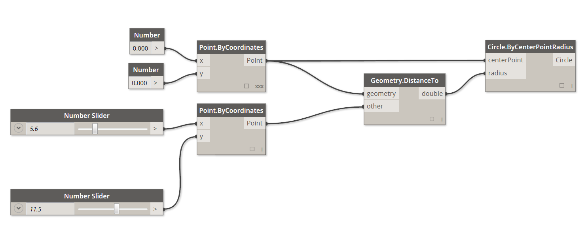
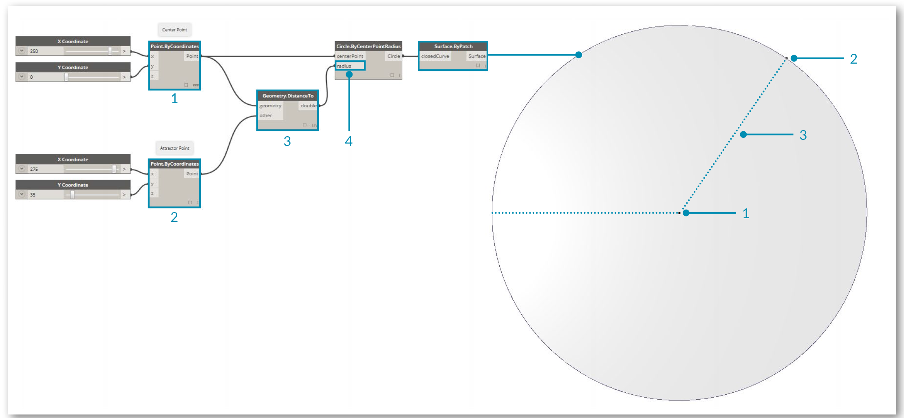

###Cosa è la programmazione visuale?

Progettare spesso richiede stabilire relazioni visive, sistemiche o geometriche tra le parti di un progetto. La maggior parte delle volte, queste relazioni sono sviluppate dal flusso di lavoro, che ci porta dal concept al risultato seguendo delle regole. Forse senza saperlo, noi lavoriamo algoritmicamente - definendo un serie di azioni passo dopo passo che segue una logica base di input, elaborazione e output. Programmare ci permette di continuare a lavorare in questo modo ma formalizzando il nostro algoritmo.

###Algoritmi in concreto
Sebbene offra delle potenti oppurtunità, il termine **Algoritmo** può portare a dei fraintendimenti. Gli algoritmi possono generare risultati inaspettati, imprevedibili o fantastici, ma non sono magici. Infatti sono abbastanza semplici di per sé. Usiamo un esempio concreto come l'origami di una gru. Iniziamo con un pezzo di carta quadrato (input), seguiamo una serie di ripiegamenti (elaborazione), ed il risultato è una gru (output).


Quindi dov'è l'algoritmo? È la serie astratta di azioni, che possiamo rappresentare in due modi - testualmente o graficamente.

**Istruzioni testuali:**

1. Inizia con un pezzo di carta quadrato, con una faccia colorata. Piegalo a metà e aprilo. Poi piegalo a metà, nell'altra direzione.
2. Gira verso l'alto il lato bianco. Piega il foglio a metà, premi bene e apri. Piega ancora nell'altra direzione.
3. Usando le pieghe che hai fatto, porta i tre angoli del modellino in alto sotto, all'angolo in basso. Appiattisci il modellino.
4. Piega i lembi esterni verso il centro e riaprili.
5. Piega la parte superiore del modellino verso il basso, piega bene e riapri.
6. Apri il lembo inferiore del modello, portandolo verso l'alto e premendo i lati del modellino verso l'interno allo stesso tempo. Appiattisci, piegando bene.
7. Capovolgi il modellino e ripeti i passi 4-6 sull'altro lato.
8. Piaga i lembi superiori nel centro.
9. Ripeti sull'altro lato.
10. Piega entrambe le “gambe” del modellimo verso l'alto, piega molto bene, poi riapri.
11. Ribalta verso l'interno e piega le “gambe” lungo le pieghe che hai appena fatto.
12. Ribalta verso l'interno e piega un lato per fare la testa, poi piega verso il basso le ali.
13. Ora hai una gru.

**Istruzioni grafiche:**


###Programmazione - Definizione
Usando una qualunque di queste due serie di istruzioni dovresti ottenere una gru, e se hai seguito il procedimento tu stesso, hai applicato un algoritmo. La sola differenza è il metodo con cui leggiamo la formalizzazione di quella serie di istruzioni e questo ci porta al concetto di **programmazione**. La programmazione è l'atto di formalizzare il processo di una serie di azioni in un programma eseguibile. Se trasformiamo le istruzioni scritte sopra per creare un origami in un formato che il nostro computer può leggere ed eseguire, stiamo programmando.

La chiave ed il primo ostacolo che incontreremo nel capire la programmazione è che dovremo affidarci a una qualche forma di astrazione per comunicare efficacemente con il nostro computer. Questa può essere uno qualunque dei numerosi linguaggi di programmazione, come Javascript, Python o C. Se riusciamo a scrivere una serie di istruzioni ripetibili, come per l'origami della gru, ciò che dobbiamo fare è tradurla per il computer. Siamo sulla buona strada per rendere il computer capace di realizzare una gru, o perfino una moltitudine di gru diverse, con leggere differenze tra una e l'altra. Questo è la potenza della programmazione - il computer eseguirà ripetutamente qualsiasi compito, o serie di compiti, gli assegneremo, senza ritardi e senza errori umani.

####Programmazione visuale - Definizione
>Scarica il file di esempio che accompagna questo esercizio (tasto destro e "Salva Link come..."): [Visual Programming - Circle Through Point.dyn](datasets/1-1/Visual Programming - Circle Through Point.dyn). Una lista completa dei file di esempio può essere trovata nell'Appendice.

Se fossi incaricato di scrivere le istruzioni per piegare l'origami della gru, come ti comporteresti? Useresti la grafica, il testo o una combinazione di entrambi?

Se la tua risposta contiene la grafica, la **Programmazione visuale** fa senz'altro per te. Il processo è essenzialmente il medesimo sia per la programmazione che per la programmazione visuale. Utilizzano la stessa struttura e formalizzazione; ciò nonostante, definiamo le istruzioni e le relazioni del nostro programma tramite un'interfaccia utente grafica (o "visuale"). Invece di digitare le istruzioni testuali in una sintassi, ci basterà connettere dei nodi preconfezionati tra loro. Ecco un confronto dello stesso algoritmo - "disegna un cerchio sulla base di un punto" - programmato con i nodi e con il codice:

**Programma visivo:**



**Programma testuale:**
```
myPoint = Point.ByCoordinates(0.0,0.0,0.0);
x = 5.6;
y = 11.5;
attractorPoint = Point.ByCoordinates(x,y,0.0);
dist = myPoint.DistanceTo(attractorPoint);
myCircle = Circle.ByCenterPointRadius(myPoint,dist);
```
Il risultato dei nostri algoritmi:



La caratteristica visiva della programmazione, in questo modo, riduce le barriere per la comprensione dell'algoritmo e spesso è più apprezzata dai progettisti. Dynamo ricade nel paradigma della programmazione visuale ma, come vedremo più avanti, possiamo anche utilizzare la programmazione testuale.
