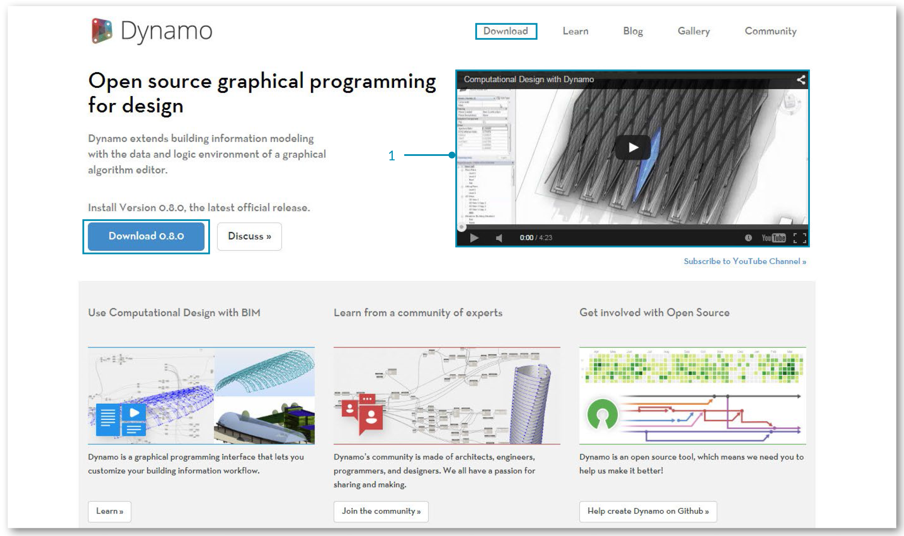

##Cosa è Dynamo?
Dyanamo è, abbastanza letteralmente, è ciò che ne fai. Lavorare con Dynamo potrebbe includere l'utilizzo dell'applicazione, sia in connessione con un software Autodesk sia autonomamente, integrare un processo di programmazone visuale, o partecipare ad un'ampia comunità di utenti e collaboratori.

###L'applicazione
Dynamo, l'applicazione, è un software che può essere scaricato ed eseguito sia autonomamente in modalità "Sandbox" o come plug-in per altri software come Revit o Maya. È descritto come: 
> Uno strumento di programmazione visuale che punta ad essere accessibile sia ai non programmatori che ai programmatori allo stesso modo. Dà agli utenti l'abilità di elaborare i comportamenti visivamente, definire blocchi logici personalizzati, ed utilizzare vari linguaggi di programmazione testuali.


> 1. Guarda Dynamo in azione con Revit
2. Scarica il programma d'installazione

###Il processo
Una volta che hai installato l'applicazione, Dynamo ci permetterà di lavorare nel processo della programmazione visuale, connettendo elementi per definire le relazioni e le sequenze di azioni che compongono gli algoritmi personalizzati. Possiamo impiegare i nostri algoritmi in un'ampia gamma di applicazione - dall'elaborazione dei dati alla generazione di geometrie - il tutto in tempo reale e senza dovere scrivere una riga di ```codice```.


> Aggiungi elementi, connetti, e siamo pronti per creare programmi visivi.

###La Comunità
Dynamo non sarebbe quello che è senza un forte gruppo di utenti appassionati e di collaboratori attivi. Unisciti alla comunità seguendo il Blog, aggiungendo il tuo lavoro alla Gallery o discutendo di Dynamo nel Forum.


###La piattaforma
Dynamo è concepito come uno strumento per la programmazione visuale per progettisti, che ci permette di realizzare strumenti che utilizzano librerie esterne o qualunque prodotto Autodesk che ha un API. Con Dynamo Studio possiamo sviluppare programmi in un'applicazione in stile "Sandbox" - ma l'ecosistema di Dynamo è in continuo sviluppo.

Il codice sorgente del progetto è open-source, permettendoci di estendere le sue funzionalità ai nostri contenuti preferiti. Controlla il progetto su Github e sfoglia i lavori in corso degli utenti che stanno personalizzando Dynamo


> Sfoglia, crea un tuo ramo ed inizia ad estendere Dynamo alle tue esigenze