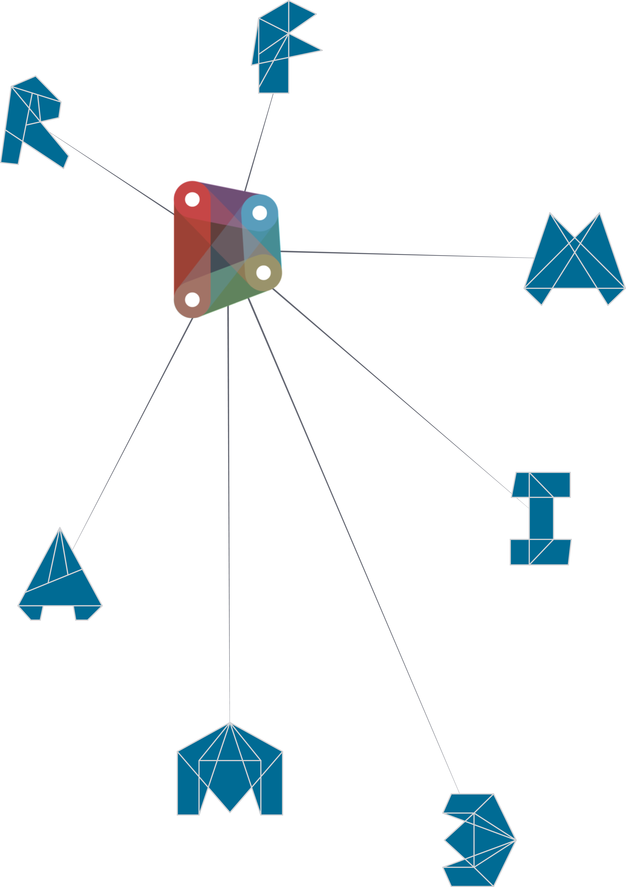

#INTRODUZIONE

Dalla sua origine come add-on per il Building Information Modeling in Revit, Dynamo è maturato per diventare molte cose. Prima di tutto è una piattaforma che consente ai progettisti di esplorare la programmazione visiva, risolvere problemi, e creare i propri strumenti. Iniziamo il nostro viaggio in Dynamo stabilendo un contesto - cosa è e come mi devo approcciare all'utilizzo?

