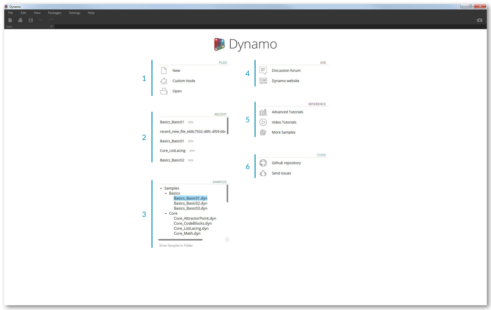
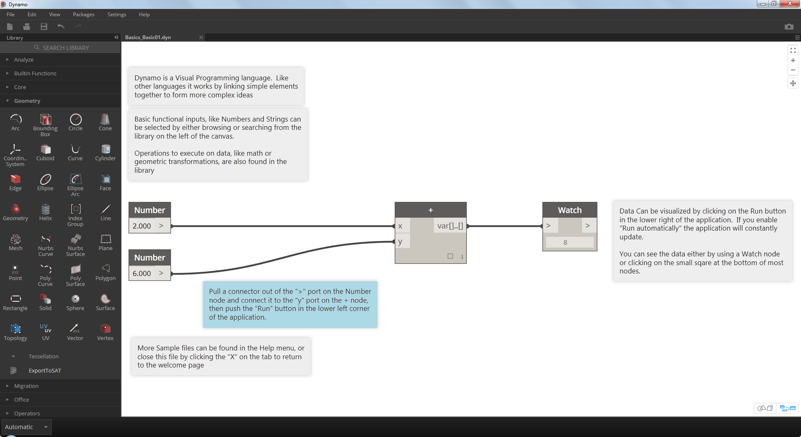

##Installare ed avviare Dynamo

Dynamo è un progetto open-source che permette di scaricare sia le versioni ufficiali del programma che le pre-release, per esempio le versioni "daily build". Scarica la versione ufficiale per iniziare, o contribuisci a ciò che Dynamo diventerà tramite le versioni daily build o il progetto su Github.

###Download
Per scaricare la versione ufficile di Dynamo visita il [sito web di Dynamo](http://dynamobim.com/). Inizia il download della versione 0.9 immediatamente cliccando dalla homepage o sfogliando la pagina dedicata al download.

> 1. Guarda un video sulla progettazione computazionale con Dynamo per l'architettura
2. O sfoglia la pagina del download

Qui puoi scaricare le versioni ancora in sviluppo o andare alla pagina [Github Dynamo](https://github.com/DynamoDS/Dynamo)

> 1. Scarica la versione ufficiale o le versioni giornaliere daily build
2. Inizia a sviluppare Dynamo su Github

###Installazione
Apri la cartella di download del programma d'installazione ed esegui il file. Durante il processo di installazione, le impostazioni presenti ti permettono di personalizzare le componenti che verranno installati.

> 1. Seleziona le componenti che vuoi installare

Qui dobbiamo decidere se vogliamo includere le componenti che connettono Dynamo alle altre applicazioni installate, come Revit. Per maggiori informazioni sulla piattaforma Dynamo, vai al **Capitolo 1.2**.

###Avvio
Per avviare Dynamo, sfoglia il menù Start di Windows > Dynamo > **Dynamo 0.9**. Verrà aperta la versione stand-alone e mostrata la *pagina iniziale* di Dynamo. Su questa pagina possiamo vedere i menù e la barra degli strumenti standard così come una collezione di scorciatoie che ci permettono di accedere a determinati file o a risorse aggiuntive.

>1. File - Crea un nuovo documento o aprine uno esistente
2. Recenti - Scorri tra i tuoi documenti recenti
3. Esempi - Controlla gli esempi che sono inclusi nell'installazione
4. Chiedi - Un accesso diretto al forum e al sito web di Dynamo
5. Riferimento - Scopri di più con risorse aggiuntive
6. Codice - Partecipa allo sviluppo del progetto open-source

Apri il primo file d'esempio per entrare nel tuo primo spazio di lavoro e assicurarti che Dynamo stia funzionando correttamente. Clicca su Samples > Basics > **Basics_Basic01.dyn**.

> 1. Assicurati che sulla barra di esecuzione ci sia la scritta "Automatico" o premi Esegui
2. Segui le istruzioni e connetti il nodo **Number** al nodo **+**
3. Assicurati che il noto Watch mostri il risultato

Se il tuo file si carica con successo dovresti essere in grado di eseguire il tuo primo programma visivo con Dynamo.
