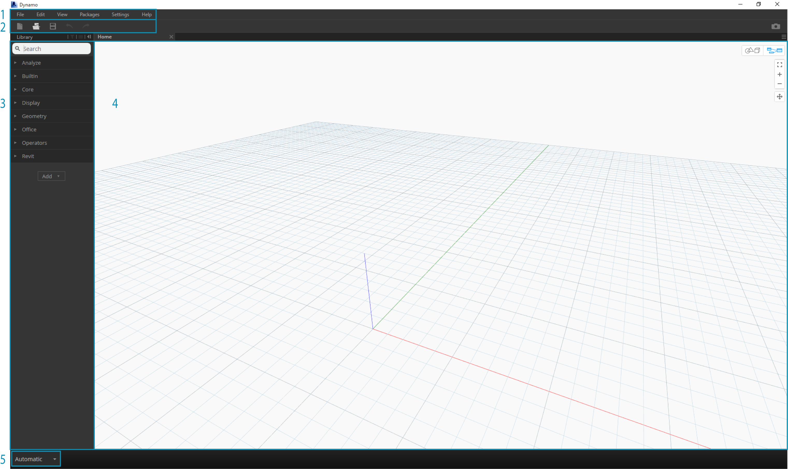
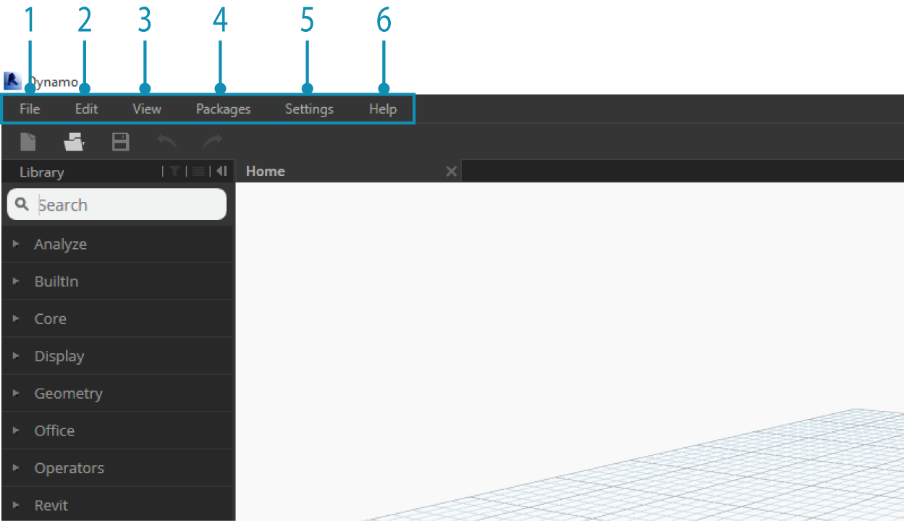
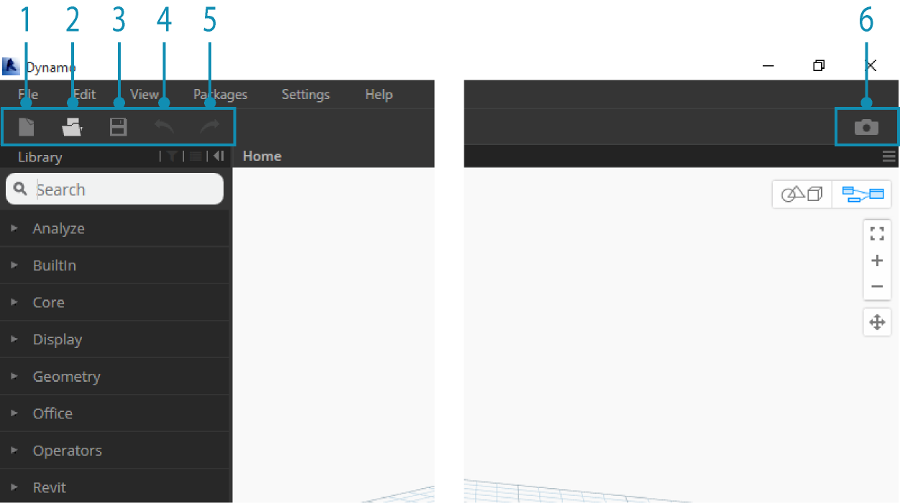
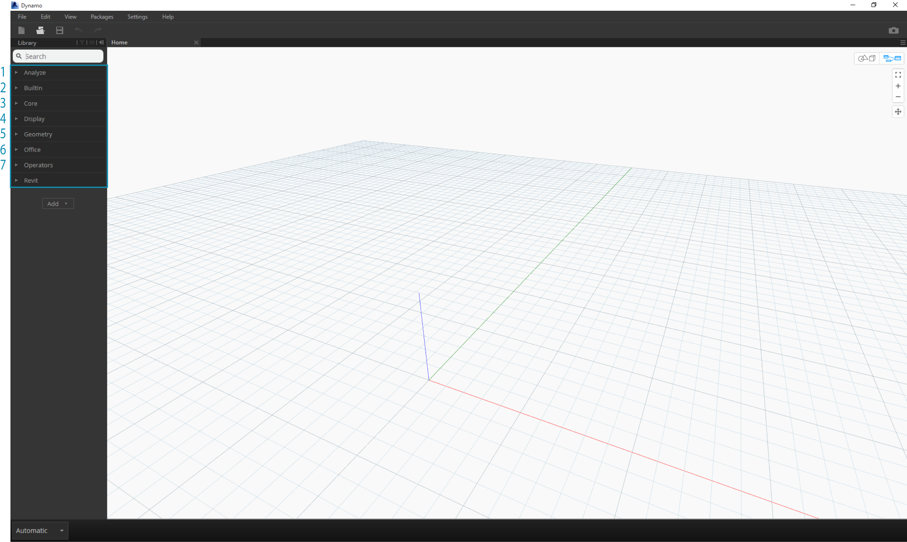
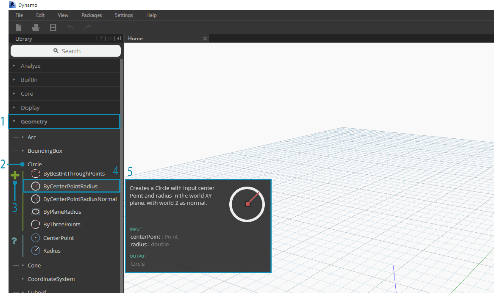
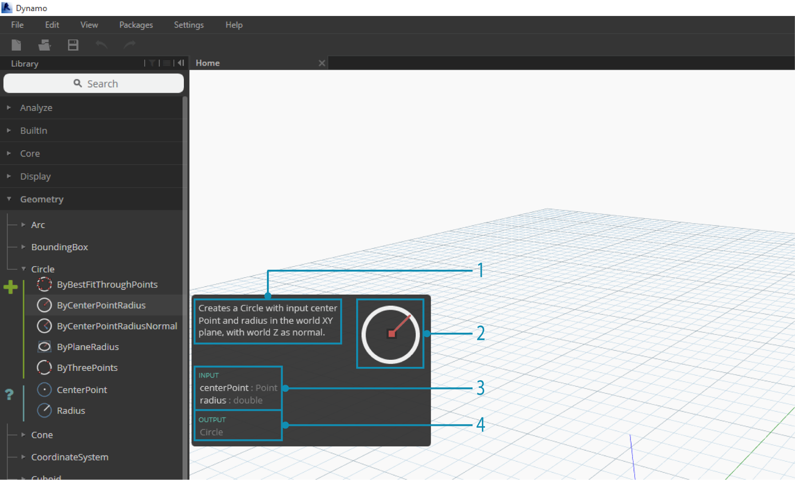
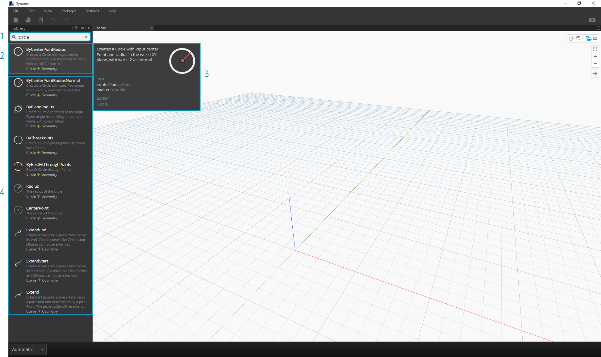
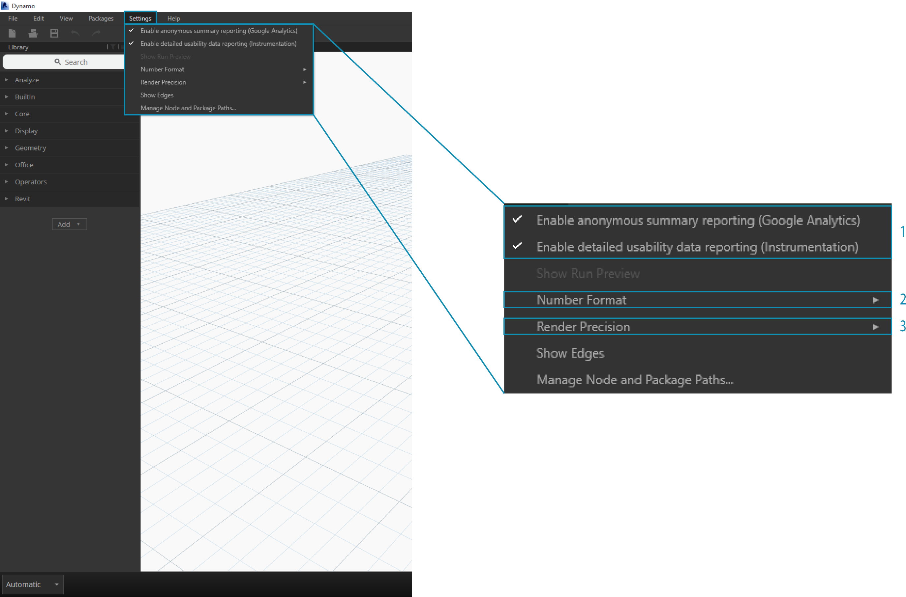
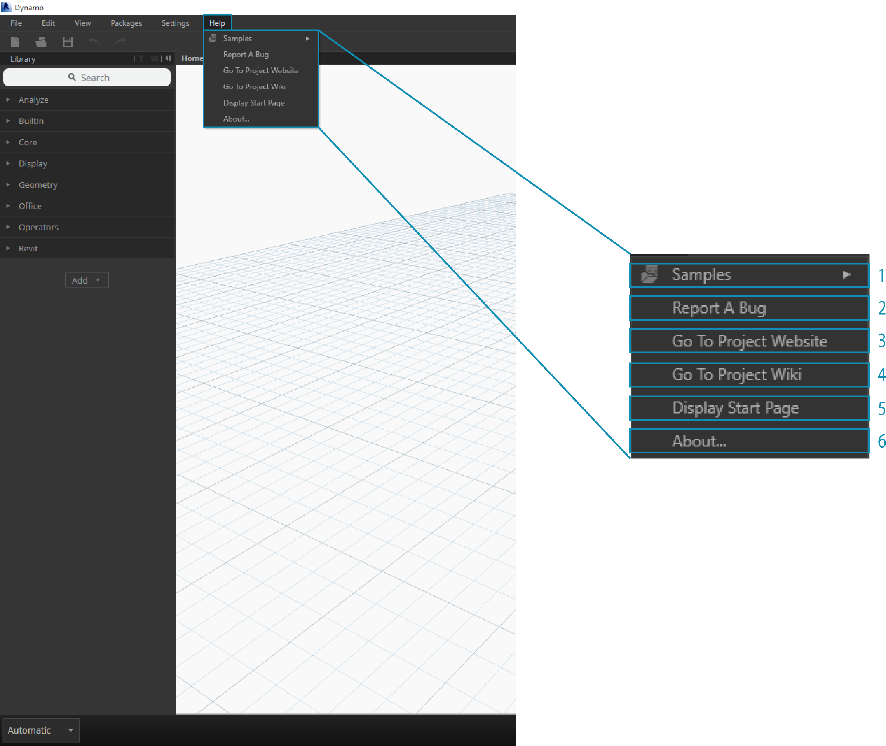

##L'interfaccia utente di Dynamo

L'interfaccia utente (UI) di Dynamo è organizzata in cinque marcoregioni, la più grande delle quali è l'area di lavoro dove componiamo i nostri programmi visivi.

>1. Menù
2. Barra degli strumenti
3. Libreria
4. Spazio di lavoro
5. Barra di esecuzione

Analizziamo approfonditamente la UI ed esploriamo le funzionalità di ogni regione.

####Menù

I menù a tendina sono il posto perfetto per trovare alcune delle funzionalità base di Dynamo. Come per la maggior parte dei software Windows, le funzioni per la gestione dei documenti e le operazioni di selezione e modifica dei contenuti si trovano nei primi due menù. I restanti menù sono quelli specifici di Dynamo.

> 1. File
2. Modifica
3. Visualizza
4. Pacchetti
5. Impostazioni
6. Aiuto

####Barra degli strumenti

La barra degli strumenti di Dynamo contiene una serie di pulsanti per un accesso rapido ai file di lavoro e i comandi Annulla [Ctrl + Z] e Ripeti [Ctrl + Y]. Sulla destra si trova un altro pulsante che esporterà un'istantanea dell'area di lavoro, una funzione estremamente utile per documentare e condividere.

> 1. Nuovo - Crea un nuovo file .dyn
2. Apri - Apri un file .dyn esistente (spazio di lavoro) o .dyf (nodo personalizzato)
3. Salva/Salva con nome - Salva il tuo file attivo .dyn o .dyf
4. Annulla - Annulla l'ultima azione
5. Ripeti - Ripeti la prossima azione
6. Esporta area di lavoro come immagine - Esporta la porzione visibile dell'area di lavoro come file .PNG

####Libreria
La libreria contiene tutti i nodi caricati, inclusi quelli standard che vengono provvisti con l'installazione così come i nodi personalizzati aggiuntivi che vengono caricati o i pacchetti. I nodi nella libreria sono organizzati gerarchicamente in librerie, categorie e, dove necessario, sotto categorie in base a ciò che il nodo **Crea**, l'**Azione** che esegue, o i dati che estrae (**Query**).

#####Sfogliare la libreria
Di default, la **libreria** conterrà otto categorie di nodi. **Core** e **Geometry** sono degli ottimi menù per iniziare a esplorare, dal momento che contengono la quantità maggiore di nodi. Sfogliare queste categorie è il modo più veloce per comprendere la gerarchia di ciò che possiamo aggiungere alla nostra area di lavoro e il migliore per scoprire nuovi nodi che non hai mai usato prima.

> Ci concentreremo sulla collezione base di nodi per adesso, ma più avanti estenderemo la libreria con nodi personalizzati, librerie aggiuntive e il gestore dei pacchetti.

>1. Analyze
2. Funzioni Built-in
3. Core
4. Geometry
5. Migration
6. Office
7. Operators

Soglia la libreria cliccando tra i menù. Clicca su Geometry > Cirle. Nota la nuova porzione di menù che è comparsa e specificatamente le etichette **Crea** e **Query**.

>1. Libreria
2. Categoria
3. Sotto categoria: Crea/Azioni/Estrai
4. Nodo
5. Descrizione del nodo e delle proprietà - appare posizionando il puntatore sull'icona del nodo.

Dallo stesso menù del cerchio, posiziona il tuo mouse su **ByCenterPointRadius**. La finestra rivela informazioni più dettagliate sul nodo oltre al suo nome e all'icona. Questo ci offre un modo veloce per capire cosa fa un nodo, cosa richiede per input e cosa darà come output.

>1. Descrizione - descrizione testuale completa del nodo
2. Icona - Versione ingrandita dell'icona nel menù della libreria
3. Input - nome, tipo di dato e struttura dei dati
4. Output - tipo di dato e struttura

#####Ricerca
Se sai abbastanza specificatamente quale nodo vuoi aggiungere alla tua area di lavoro, il campo **Cerca** è il tuo migliore amico. Quando non stai modificando le impostazioni o specificando valori nello spadio di lavoro, il cursore è sempre attivo in questo campo. Se inizi a digitare, la libreria di Dynamo mostrerà una selezione delle migliori corrispondenze (con le indicazioni per sapere in quele categoria di nodi si trova) e una lista delle corrispondenze alternative alla ricerca. Quando premi Invio, o clicchi su un oggetto nel browser, il nodo evidenziato viene aggiunto al centro dello spazio di lavoro.

>1. Campo di ricerca
2. Miglior risultato / Selezionato
3. Corrispondenze alternative

###Impostazioni
Dalle impostazioni geometriche a quelle utente, le opzioni possono essere trovate nel menù **Impostazioni**. Qui puoi scegliere se condividere o meno i tuoi dati utenti per migliorare Dynamo così come definire il formato numerico nell'applicazione e la precisione del rendering.

> Nota: Ricorda che le unità di Dynamo sono generiche.

>1. Attiva rapporti
2. Formato numerico
3. Precisione di rendering

###Aiuto
Se sei bloccato, controlla il menù **Aiuto**. Qui puoi trovare i file di esempio che sono inclusi nell'installazione o accedere a uno dei siti di riferimento di Dynamo dal tuo browser internet. Se hai bisogno, controlla la versione di Dynamo installata e se è aggiornata dall'opzione "Informazioni su...".

>1. Esempi - Esempi
2. Segnala un bug - Riporta un malfunzionamento
3. Vai al sito Web del progetto - Vai al sito web del progetto
4. Vai alla pagina Wiki del progetto - Vai alla Wiki del progetto
5. Visualizza la pagina iniziale - Mostra la pagina iniziale
6. Informazioni su... - Informazioni

