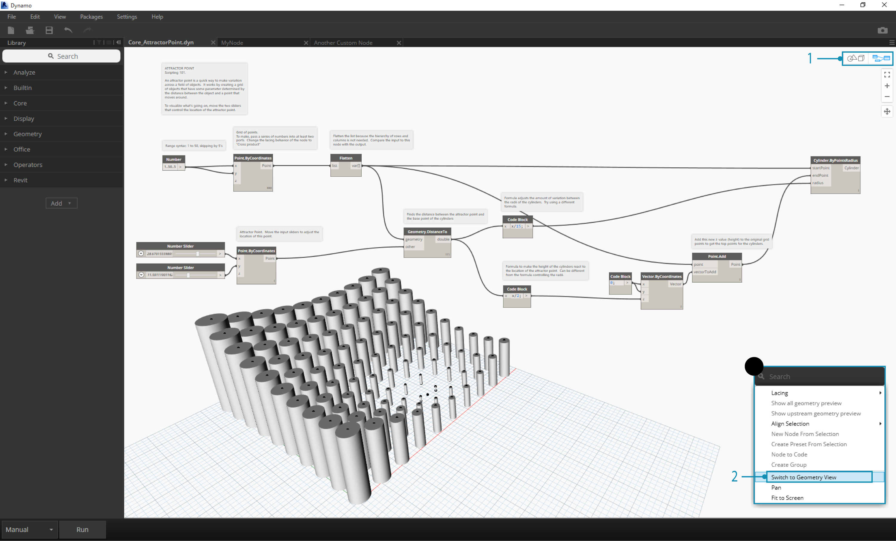
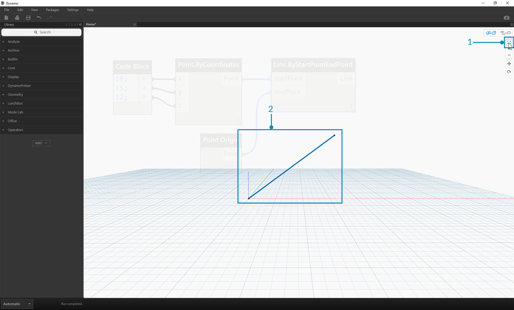

##L'area di lavoro

In Dynamo l'**area di lavoro** è dove sviluppiamo i nostri programmi visivi, ma è anche dove vediamo in anteprima ogni geometria risultante. Sia se stiamo operando in un'area di lavoro normale che in un nodo personalizzato, possiamo navigare con il nostro mouse o con i bottoni in alto a destra. Azionando i pulsanti in alto a destra possiamo invece cambiare l'anteprima che vogliamo navigare.

> Nota: I nodi e le relative geometrie vengono disegnati seguendo un ordine preciso, quindi potresti visualizzare oggetti sovrapposti. L'anteprima potrebbe diventare poco chiara quando si aggiungono più nodi in sequenza, in quanto potrebbero essere visualizzati nella medesima posizione nell'area di lavoro.

>1. Schede
2. Pulsanti per Zoom/Pan 
3. Modalità anteprima
4. Doppio click nell'area di lavoro

###Schede
Attivare una scheda ti permette di navigare nella relativa area di lavoro e modificare il tuo programma. Quando apri un nuovo file, di default stai aprendo una nuova area di lavoro **base**. Potresti anche aprire un'area di lavoro per un nuovo **nodo personalizzato** dal menù file o dall'opzione *Nuovo nodo dalla selezione* cliccando con il tasto destro quando dei nodi sono selezionati (parleremo più avanti di questa funzionalità).

> Nota: Puoi avere una sola area di lavoro base aperta per volta; ciò nonostante potresti avere diverse aree di lavoro per nodi personalizzati aperti in schede aggiuntive.

###Navigazione del grafico e dell'anteprima 3D
In Dynamo, il grafico e il risultato 3D del grafico (se stiamo creando delle geometrie) sono entrambi visualizzati nello spazio di lavoro. Di default quella del grafico è l'antemprima attiva, quindi usando i pulsanti di navigazione o il tasto centrale del mouse per effettuare un pan o uno zoom ci muoveremo nel grafico. È possibile cambiare l'anteprima attiva in tre diversi modi:

> 1. I pulsanti di anteprima nell'area di lavoro
2. Cliccando con il tasto destro nell'area di lavoro e selezionando *Passa alla vista ...*
3. Scorciatoia da tastiera (Ctrl + B)

La modalità navigazione nell'anteprima sfondo 3D ci permette anche di effettuare una **Manipolazione diretta** dei punti, come spiegato in [Iniziare con Dynamo](http://dynamoprimer.com/02_Hello-Dynamo/2-6_the_quick_start_guide.html).

###Zoom per centrare

Possiamo facilmente translare, ingrandire e ruotare liberamente intorno ai modelli nella modalità di navigazione dell'anteprima sfondo 3D. Se invece vogliamo ingrandire specificatamente su un oggetto generato da un nodo geometrico, possiamo usare l'icona Ingrandisci Tutti con un solo nodo selezionato.

> 1. Seleziona il nodo corrispondente alla geometria su cui vuoi centrare la vista.
2. Attiva la navigazione dell'anteprima sfondo 3D.

> 1. Clicca sull'icona Ingrandisci Tutti in alto a destra.
2. La geometria selezionata verrà centrato nella vista.

###Hello Mouse!

A seconda di quale modalità di anteprima è attiva, i pulsanti del tuo mouse si comporteranno in modo differente. In generale, il tasto sinistro seleziona e specifica gli input, quello destro ti da accesso alle opzioni e il tasto centrale ti permette di navigare nell'area di lavoro. Il click con il tasto destro ti presenterà opzioni diverse a seconda del contesto in cui stai cliccando.

>1. Click con il tasto destro sull'area di lavoro.
2. Click con il tasto destro su un nodo.
3. Click con il tasto destro su una nota.

Ecco una tabella delle interazioni del mouse a seconda dell'anteprima:

**Azione del Mouse** | **Anteprima grafico** | **Anteprima sfondo 3D**
--- | --- | ---
Tasto sinistro | Seleziona | n/d
Tasto destra | Menù contestuale | Opzioni zoom
Tasto centrale | Pan | Pan
Scroll | Zoom In/Out | Zoom In/Out
Doppio click | Crea un blocco di codice | n/d

###Ricerca sulla tela

Usare la "ricerca sulla tela" aggiungerà sensibilmente velocità al tuo flusso di lavoro in Dynamo, mettendoti a disposizione l'accesso alla descrizioni dei nodi ed ai consigli rapidi senza dovere lasciare il tuo posto sul grafico! Semplicemente cliccando con il tasto destro, puoi accedere a tutte le utili funzionalità della "ricerca nella libreria" da ovunque ti trovi a lavorare sulla tela.

>1. Clicca con il tasto destro ovunque sulla "tela" per aprire la funzione di ricerca. Quando la barra è vuota, la tendina sarà un menù dell'anteprima.
2. Digitando nella barra di ricerca, il menù a tendina si aggiornerà continuamente per mostrare i risultati più rilevanti.
3. Posiziona il mouse sul risultato della ricerca per aprire la descrizione e i consigli rapidi corrispondenti.

##Semplifica layout nodi
Mantenere la tela di Dynamo ordinata diventa sempre più importante con il crescere della complessità del tuo programma. Anche se abbiamo lo strumento **Allinea selezione** per lavorare con una piccola quantità di nodi, Dynamo ci mette a disposizione anche lo strumento **Semplifica layout nodi** per aiutarci nella semplificazione generale del file.
####Prima la semplificazione dei nodi

>1.	Seleziona i nodi che devono essere organizzati automaticamente, o non selezionarne nessuno se vuoi semplificare il layout di tutti i nodi del file.
2.	La funzione Semplifica layout nodi è posizionata nell menù Modifica.
####Dopo la semplificazione dei nodi

>1.	I nodi verranno automaticamente redistribuiti e allineati, aggiustando tutti i nodi fuori posto o sovrapposti e allineandoli con i nodi vicini.

