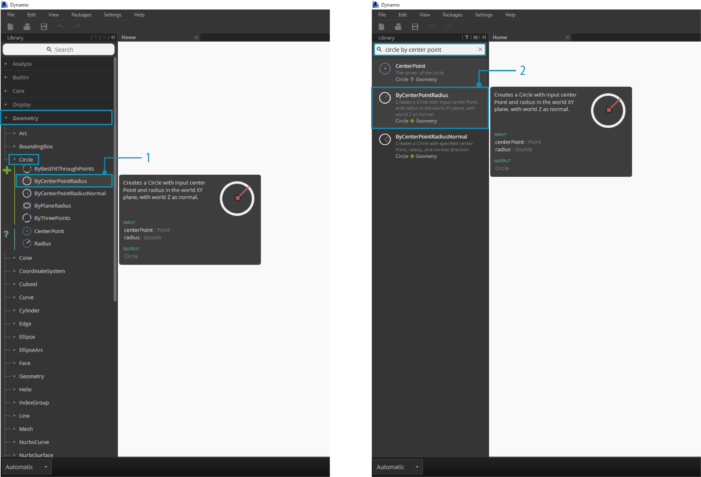
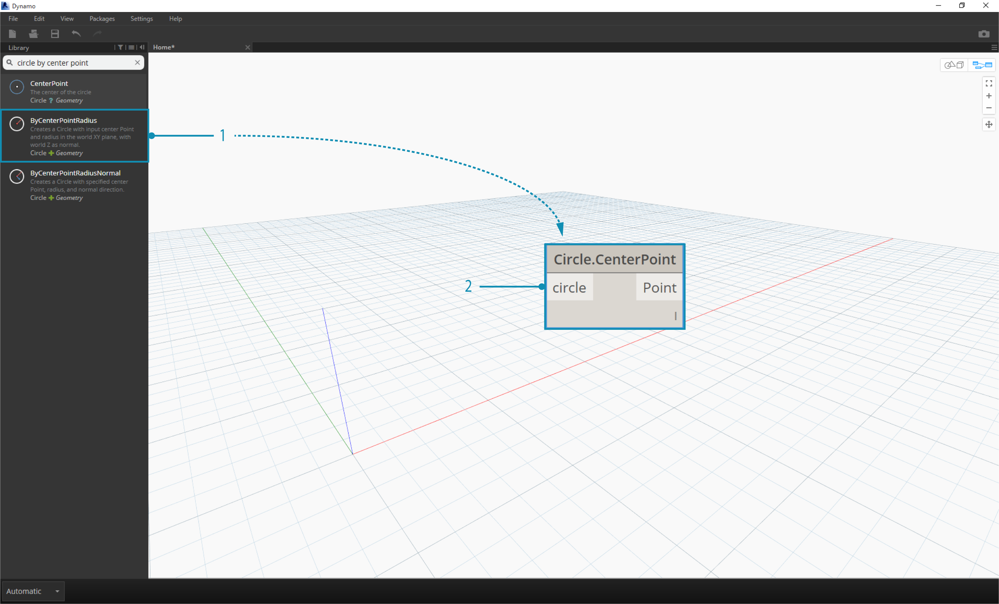
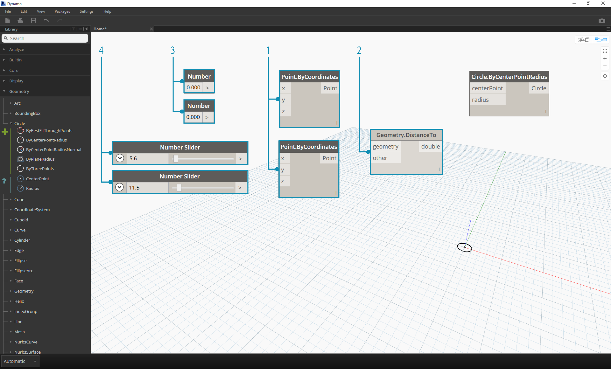
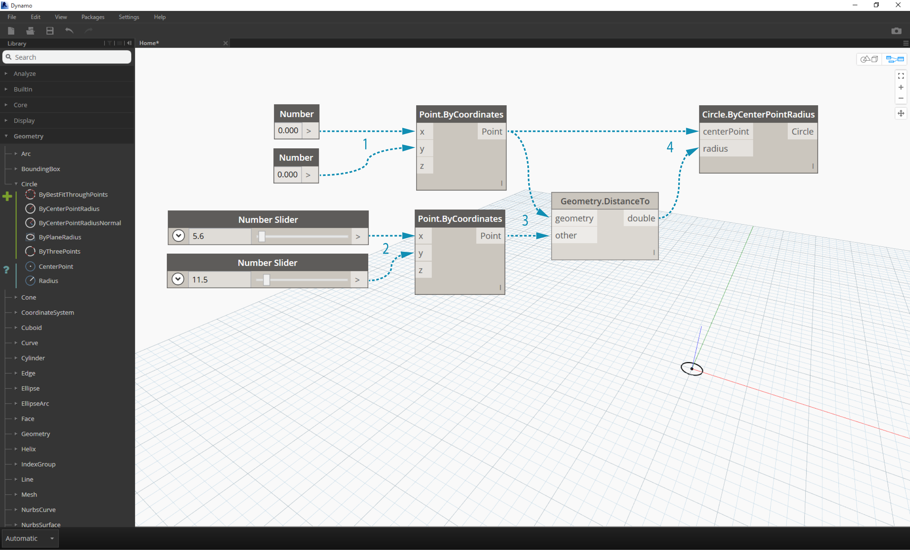
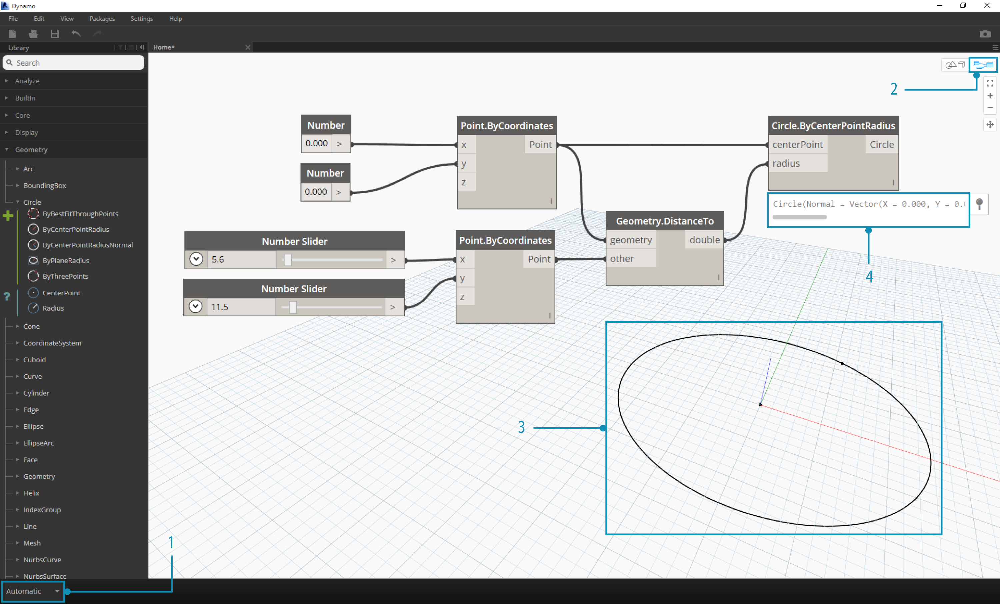
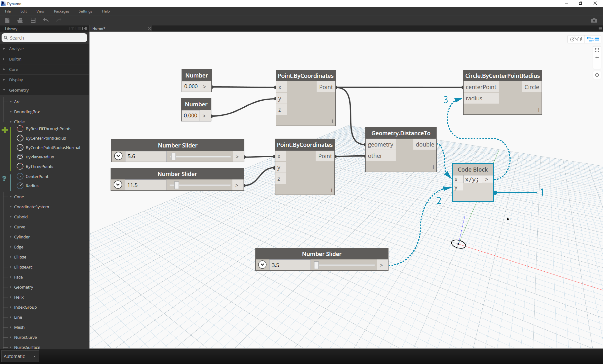
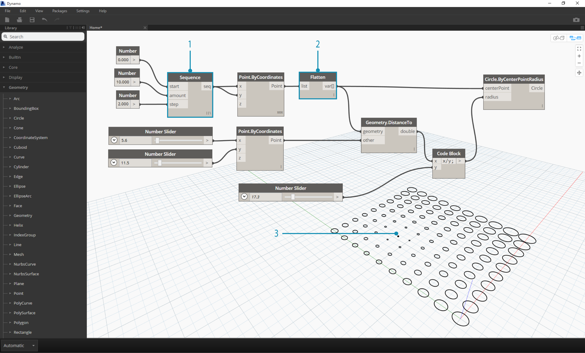
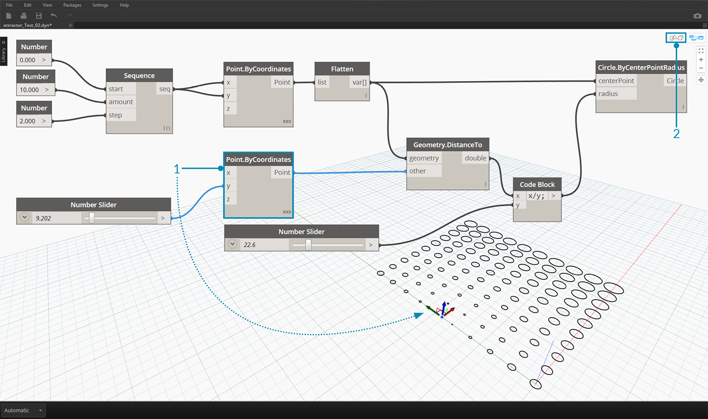
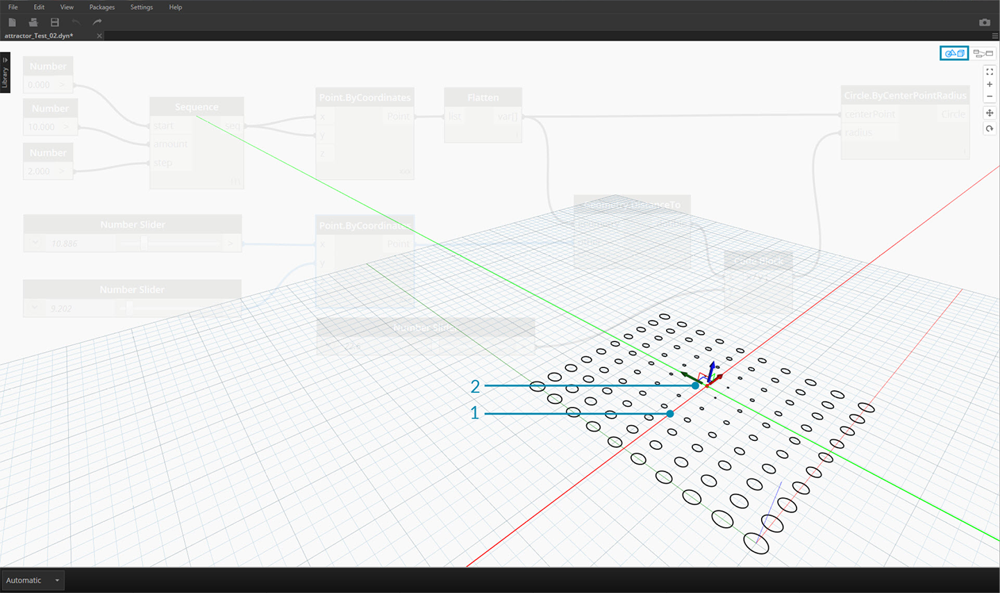
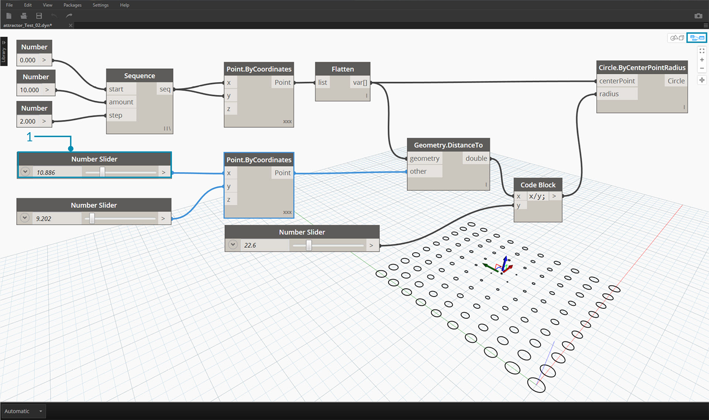

##INIZIARE CON DYNAMO

Ora che abbiamo familiarizzato con l'interfaccia e la navigazione nell'area di lavoro, il nostro prossimo passo è quello di capire il flusso di lavoro tipico per lo sviluppo di un grafico in Dynamo. Iniziamo creando un cerchio di dimensione variabile e poi creando una serie di cerchi con raggi diversi.

###Definire gli obiettivi e le relazioni
Prima di aggiungere un qualsiasi nodo all'area di lavoro, è essenziale avere una solida comprensione di ciò che stiamo tentando di ottenere e quali relazioni significative ci saranno. Ricorda che ogni volta che connettiamo due nodi stiamo creando un collegamento esplicito tra di loro - potremmo voler cambiare il flusso dei dati più avanti, ma una volta collegati siamo vincolati a quella relazione. In questo esercizio vogliamo creare un cerchio (*obiettivo*) nel quale l'input del raggio sia definito dalla distanza ad un punto vicino (*relazione*).


> Un punto che definisce una distanza basata su una relazione è comunemente chiamato "attrattore". Qui la distanza dal nostro punto attrattore sarà usata per specificare quanto dovrà essere grande il nostro cerchio.

###Aggiungere nodi all'area di lavoro
Ora che abbiamo definito i nostri obiettivi e le relazioni possiamo iniziare a creare il nostro grafico. Abbiamo bisogno dei nodi che rappresentano la sequenza di azioni che Dynamo dovrà eseguire. Visto che sappiamo che stiamo provando a creare un cerchio, iniziamo a posizionare un nodo adeguato. Usando il campo di ricerca o sfogliando la libreria, scopriremo che c'è più di un modo per creare un cerchio.


> 1. Sfoglia fino a Geometry > Circle > **Circle.ByPointRadius**
2. Cerca > "Circle by Point..."

Aggiungiamo il nodo **Circle.ByPointRadius** all'area di lavoro cliccandolo nella libreria - il nodo dovrebbe comparire al centro dell'area di lavoro.



> 1. Il nodo Circle.ByPointandRadius nella libreria
2. Cliccare il nodo nella libreria lo aggiunge all'area di lavoro

Avremo bisogno anche dei nodi **Point.ByCoordinates**, **Number Input** e **Number Slider**



> 1. Geometry > Point > **Point.ByCoordinates**
2. Geometry > Geometry > **DistanceTo**
2. Core > Input > **Number**
3. Core > Input > **Number Slider**

###Connettere i nodi con i cavi
Ora che abbiamo qualche nodo, dobbiamo connettere le porte dei nodi con i cavi. Queste connessioni definiranno il flusso dei dati.


> 1. da **Number** a **Point.ByCoordinates**
2. da **Number Sliders** a **Point.ByCoordinates**
3. da **Point.ByCoordinates** (2) a **DistanceTo**
4. da **Point.ByCoordinates** e **DistanceTo** a **Circle.ByCenterPointRadius**

###Eseguire il programma
Dopo avere definiro il flusso del programma, tutto ciò che manca è dire a Dynamo di eseguirlo. Una volta che il nostro programma viene eseguito (sia automaticamente sia cliccando Esegui nella modalità manuale), i dati passano attraverso i cavi, e dovremmo vedere il risultato nell'anteprima 3D.


> 1. (Clicca Esegui) - Se la barra di esecuzione è in modalità manuale, dobbiamo cliccare Esegui per eseguire il diagramma
2. Anteprima dei nodi - Posizionando il mouse sopra il riquadro sull'angolo in basso a destra di un nodo ti darà un pop-up dei risultati
3. Anteprima 3D - Se uno qualunque dei nostri nodi crea una geometria, lo vedremo nell'anteprima 3D.

###Aggiungere dettagli
Se il nostro programma sta funzionando correttamente, dovremmo vedere un cerchio nell'anteprima 3D che passa per il nostro punto attrattore. Questo è ottimo, ma potremmo voler aggiungere più dettagli o controlli. Proviamo per esempio ad aggiustare gli input nel nodo del cerchio così da poter calibrare l'influenza sul raggio. Aggingiamo un altro **Number Slider** allo'area di lavoro, poi clicchiamo in uno area vuota dell'area di lavoro per aggiungere un nodo **Code Block**. Modifica il campo nel blocco di codice, specificando ```X/Y```.


>1. **Code Block**
2. da **DistanceTo** e **Number Slider** a **Code Block**
3. da **Code Block** a **Circle.ByCenterPointRadius**

###Aggiungere complessità
Iniziare con semplicità e aggiungere complessità è un modo efficace per sviluppare il nostro programma. Una volta che funziona per un cerchio, possiamo applicare la potenza del programma a più di un cerchio. Invece di un solo centro, se usassimo una griglia di punti e adattassimo la struttura dei dati risultante al cambiamento, il nostro programma creerebbe molti cerchi - ognuno con un valore di raggio unico definito dalla distanza calibrata dal punto attrattore.


>1. Aggiungi un nodo **Number Sequence** e sostituisci gli input del nodo **Point.ByCoordinates** - Clicca con il tasto destro sul nodo Point.ByCoordinates e seleziona Collegamento > Globale
2. Aggiungi un nodo **Flatten** dopo Point.ByCoordinates
3. L'anteprima 3D si aggiornerà con una griglia di cerchi

###Regolare con la manipolazione diretta
Qualche volta la manipolazione numerica non è l'approccio corretto. In alternativa possiamo allontanare e avvicinare punti della geometria navigando nell'anteprima sfondo 3D. Possiamo anche controllare altre geometrie che sono state costruite da un punto. Per esempio, **Sphere.ByCenterPointRadius** è anch'essa passibile di una manipolazione diretta. Possiamo controllare la posizione di un punto da una serie di valori X, Y e Z con **Point.ByCoordinates**. Con l'approccio della manipolazione diretta sei però in grado di aggiornare i valori dei dispositivi di scorrimento muovendo manualmente il punto nella modalità **navigazione anteprima sfondo 3D** Questa tecnica offre un approccio più intuitivo per controllare una serie di valori che identificano la posizione di un punto.


>1. Per usare la **manipolazione diretta**, seleziona il nodo del punto da muovere - delle frecce appariranno sul punto selezionato.
2. Attiva la modalità **navigazione anteprima sfondo 3D**.


>1. Posiziona il mouse sul punto e gli assi X, Y e Z appariranno.
2. Clicca e trascina le frecce colorate per muovere gli assi corrispondenti, i valori del **Number Slider** si aggiorneranno in diretta con il movimento manuale del punto.


>1. Nota che prima della **manipolazione diretta** solo uno slider era inserito nel componente **Point.ByCoordinates**. Quando abbiamo mosso manualmente il punto nella direzione X, Dynamo ha automaticamente generato un nuovo **Number Slider** per l'input X.
