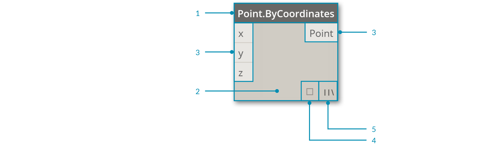
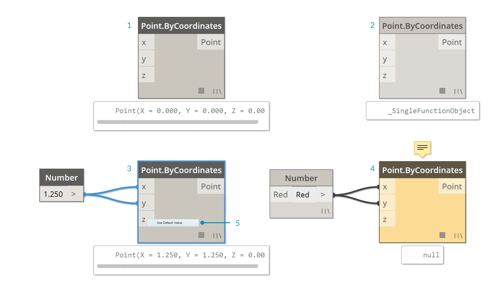
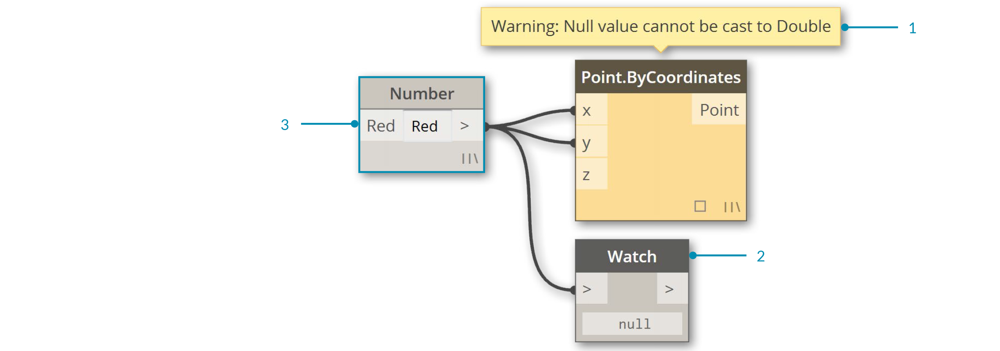

##I Nodi

In Dynamo, i **nodi** sono oggetti che puoi connettere tra di loro per creare un programma visivo. Ogni **nodo** esegue un'operazione - a volte potrebbe essere semplice come archiviare un numero o potrebbe essere un'azione più complessa come creare una geometria.

###L'anatomia di un nodo
La maggior parte dei nodi in Dynamo sono composti da cinque parti. Sebbene ci possano essere delle eccezioni, come i nodi di input, l'anatomia di ogni nodo può essere descritta come segue:

>1. Nome - Il nome del nodo seguendo la convenzione Categoria.Nome
2. Corpo - Il corpo principale del nodo - Cliccare con il tasto destro qui ti permette di accedere alle opzioni per controllare l'intero nodo
3. Porte (input ed output) - I recettori dei wire che forniscono i dati di input al nodo e restituiscono il risultato dell'azione del nodo
4. Anteprima dei dati - Posiziona il mouse o clicca qui per vedere una finestra con i risultati dell'azione del nodo
5. Icona di collegamento - Indica l'opzione di collegamento specificata per elaborare le liste in input (maggiori informazioni più avanti)

### Porte
Gli input e gli output dei nodi sono chiamati porte e agiscono come ricettori per i wire. I dati arrivano al nodo passando per le porte sulla sinistra ed escono, dopo che il nodo ha eseguito le sue operazioni, a destra. Le porte si aspettano di ricevere dati di un certo tipo. Per esempio, connettere un numero come *2.75* alle porte di un nodo Point By Coordinates creerà con successo un punto; invece, se forniamo *"Rosso"* alla stessa porta otteremo un errore. 

> Consiglio: Posiziona il mouse su una porta per vedere una finestra rapida con il tipo di dato è previsto.

>1. Etichetta della porta
2. Finestra rapida
3. Tipo di dato

###Stato
Dynamo dà un indicatore dello stato dell'esecuzione del tuo programma visivo visualizzando i nodi con uno schema di colori differenti in base alla condizione di ogni modo. Inoltre posizionare il mouse o cliccare con il tasto destro sul nome o sulle porte ci darà ulteriori informazioni e opzioni.

>1. Inattivo - I nodi grigi sono inattivi e devono essere connessi con dei wire per essere parte integrante del flusso del programma
2. Attivo - I nodi con uno sfondo grigio scuro sono ben connessi ed hanno tutti i loro input collegati con successo
3. Avvertimento - I nodi gialli contengono un errore
4. Selezionato - I nodi attualmente selezionati hanno un bordo blu
5. Valore di default - Click con il tasto destro su una porta di input - alcuni nodi hanno un valore di default che può essere usato o meno.

Se i tuoi programmi visivi contengono degli avvertimenti o degli errori, Dynamo ti fornirà delle informazioni aggiuntive sul problema. Ogni nodo giallo avrà anche un suggerimento al di sopra del nome. Posiziona li il tuo mouse per espanderlo.

> Consiglio: Una volta lette le informazioni sull'errore, esamina i nodi precedenti per vedere se il tipo o la struttura dei dati sono la causa dell'errore.

> 1. Consiglio sull'avvertimento - Un dato "nullo" o nessun dato non può essere letto come un dato Double (per esempio un numero)
2. Usa il nodo Watch per esaminare i dati in input
3. Il nodo Number precedente ha come valore "red" e non un numero.
