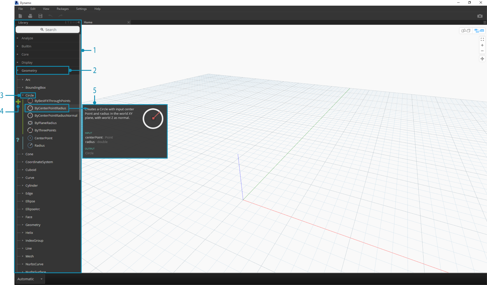
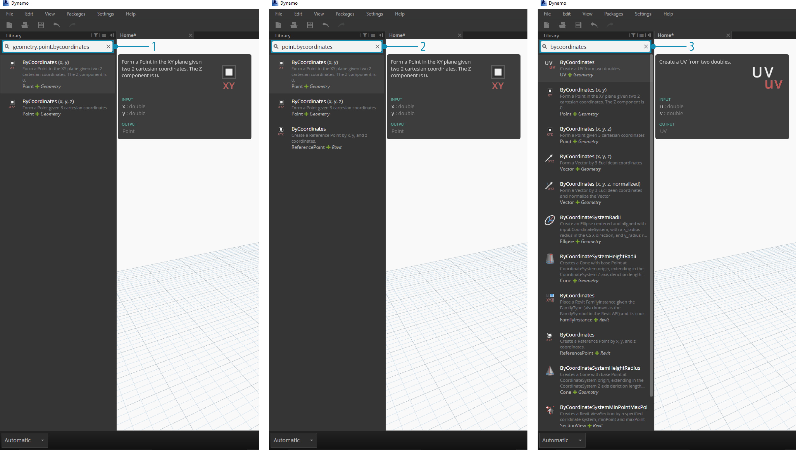
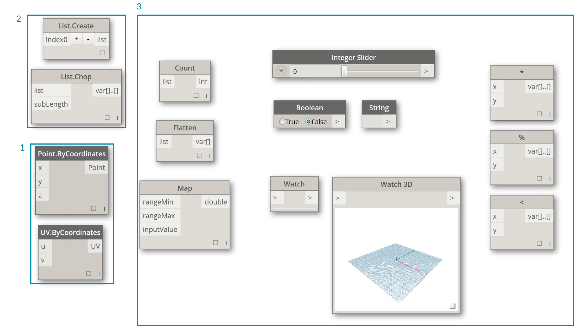
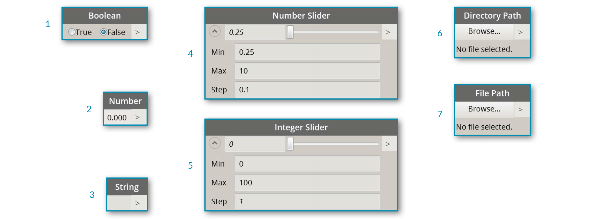
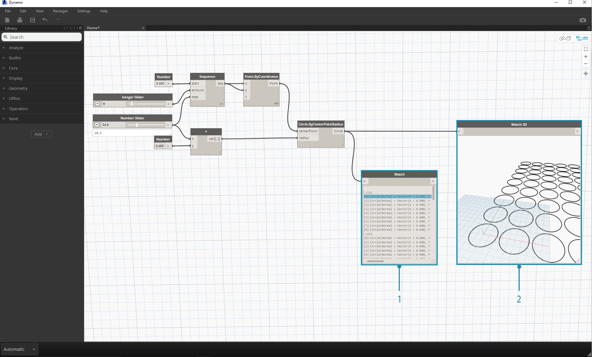
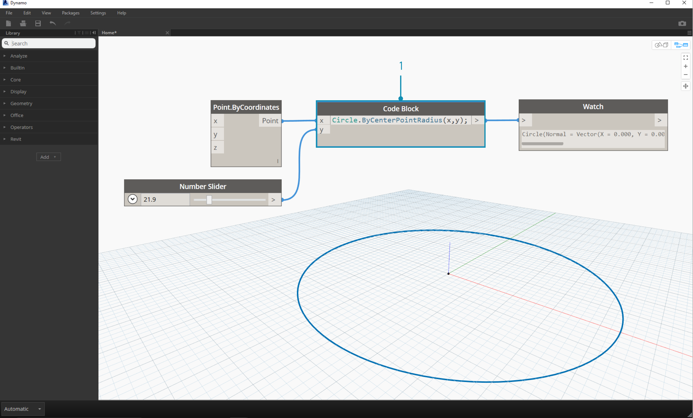

##La libreria di Dynamo

La **libreria di Dynamo** contiene i nodi da aggiungere all'area di lavoro per definire l'esecuzione di un programma visivo. Nella libreria, possiamo cercare o sfogliare i nodi. I nodi contenuti qui - i nodi base installati, i nodi personalizzati che abbiamo creato, e i nodi del Package Manager che possiamo aggiungere a Dynamo - sono organizzati gerarchicamente per categoria. Diamo un'occhiata a questa organizzazione ed esploriamo i nodi chiave che utilizzeremo frequentemente.

###Libreria di librerie
La **libreria** di Dynamo presente nell'applicazione è in realtà una collezione di librerie funzionali, ognuna contenente dei nodi raggruppati per categoria. Sebbene possa sembrare confusionale in un primo momento, si tratta di una struttura flessibile per organizzare i nodi inclusi nell'installazione standard di Dynamo - ed è ancora più utile quando iniziamo ad estendere questa funzionalità base con i nodi personalizzati e i pacchetti aggiuntivi.

####Lo schema organizzativo
La sezione **libreria** della UI di Dynamo è composta da librerie organizzate gerarchicamente. Scendendo sempre più a fondo nella libreria, stiamo sequenzialmente consultanto una libreria, le categorie di una libreria, le sottocategorie di una categoria per trovare un nodo.



> 1. La libreria - La regione nell'interfaccia di Dynamo
2. Una libreria - Una collezione di categorie correlate, come **Geometry**
3. Una categoria - Una collezione di nodi correlati, come tutti quelli legati a **Circles**
4. Una sottocategoria - Insieme di nodi all'interno di una categoria, tipicamente divisi in **Crea**, **Azione**  o **Query**
5. Un nodo - Gli oggetti che vengono aggiunti all'area di lavoro per eseguire un'azione

####Convenzioni per la denominazione
La gerarchia di ogni libreria è riflessa nel nome dei nodi aggiunti all'area di lavoro, che possiamo inserire anche nel campo di ricerca o nei blocchi di codice (che usano il *linguaggio testuale di Dynamo*). Oltre ad utilizzare le parole chiave per trovare i nodi, possiamo scrivere anche la gerarchia separata da un punto.

Digitare nel campo di ricerca porzioni differenti del nome del nodo nel formato ```libreria.categoria.nomeNodo``` restituirà risultati diversi:



> 1. ```libreria.categoria.nomeNodo```
2. ```categoria.nomeNodo```
3. ```nomeNodo``` o ```parolaChiave```

Normalmente il nome del nodo nell'area di lavoro verrà visualizzato nel formato ```categoria.nomeNodo```, con alcuni eccezioni notevoli nelle categorie Input e View. Fai attenzione a nodi con nomi simili ed esamina le categorie di appartenenza:



> 1. ```Point.ByCoordinates``` e ```UV.ByCoordinates``` hanno lo stesso nome ma categorie differenti
2. I nodi della maggior parte delle librerie includono il formato completo del nome
3. Le eccezioni notevoli includono funzioni Built-in, Core.Input, Core.View e gli Operatori.

###Nodi frequentemente usati
Tra i migliaia di nodi inclusi nell'installazione base di Dynamo, quali sono quelli essenziali per sviluppare i nostri programmi visivi? Concentriamoci su quelli che ci permettono di definire i parametri del nostro programma (**Input**), vedere il risultato dell'azione di un nodo (**Watch**), e definire input o funzioni in un modo più rapido (**Code Block**).

####Input
I nodi di input sono gli strumenti primari per l'utente del nostro programma visivo - sia tu stesso o qualcun altro - per interfacciarsi con i parametri chiave. Questi sono i nodi disponibili nella categoria Input della libreria Core:


> 1. Boolean
2. Number
3. String
4. Number Slider
5. Integer Slider
6. Directory Path
7. File Path

####Nodi di osservazione
I nodi di osservazione sono essenziali per gestire i dati che fluiscono nei tuoi programmi visivi. Sebbene sia possibile vedere il risultato di un nodo nell'anteprima dati del nodo stesso, potresti volerlo mantenere visibile in un nodo **Watch** o vedere le geometrie risultanti in un nodo **Watch3D**. Entrambi possono essere trovati nella categoria View della libreria Core. 

> Consiglio: Occasionalmente l'anteprima 3D potrebbe distrarre, soprattutto quando i tuoi programmi visivi contengono molti nodi. Considera la possibilità di disattivare l'opzione Mostra anteprima esecuzione nel menù Impostazioni ed usare un nodo Watch3D per vedere in anteprima la tua geometria.



> 1. Watch - Nota che quando selezioni un oggetto nel nodo Watch verrà evidenziato nei nodi Watch3D e nelle anteprime 3D
2. Watch3D - Afferra l'angolo in basso a destra per ridimensionarlo e naviga con il tuo mouse nello stesso modo con cui navighi nell'anteprima 3D

####Nodo del blocco di codice
I nodi **Code Block** possono essere usati per definire un blocco di codice con righe separate da un punto e virgola. Può anche essere semplice come ```X/Y```. Possiamo anche usare i blocchi di codice come scoriatoie per definire un input numerico o richiamare una funzione di un altro nodo. In questo caso la sintassi segue le convenzioni per la denominazione incluse nel linguaggio testuale di Dynamo nella sezione 3.2.3. Proviamo a creare un cerchio con questa scorciatoia:



>1. Esegui un doppio click per creare un nodo **Code Block**
2. Digita ```Circle.ByCenterPointRadius(x,y);```
3. Clicca nell'area di lavoro per aggiornare il nodo, gli input ```x``` e ```y``` dovrebbero aggiungersi automaticamente
4. Crea un nodo **Point.ByCoordinates** e un **Number Slider** poi connettili agli input del blocco di codice
5. Il risultato dell'esecuzione del programma visivo dovrebbe essere un cerchio nell'anteprima 3D


