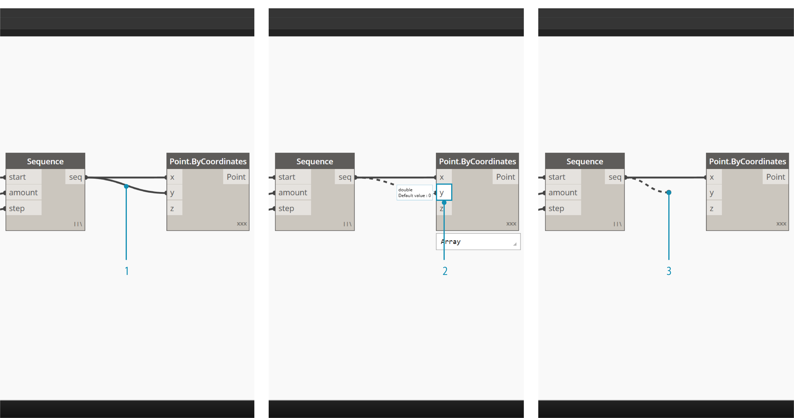

##I Wire

I wire connettono i nodi tra di loro per creare relazioni e determinare il flusso del nostro programma visivo. Possiamo pensare a loro letteralmente come dei cavi elettrici che portano impulsi di dati da un oggetto al successivo.


###Flusso del programma
I wire connettono la porta output di un nodo alla porta input del successivo. Questa direzionalità stabilisca il **flusso dei dati** nel programma visivo. Anche se possiamo sistemare i nostri nodi come vogliamo nell'area di lavoro, vista la posizione delle porte di output sulla destra del nodo e le porte di input sulla sinistra, diciamo generalmente che il flusso del programma si muove da sinistra a destra.


###Creare un wire
Possiamo creare un wire cliccando con il tasto sinistro su una porta e poi cliccando sulla porta di un altro nodo, così da creare un collegamento. Mentre stiamo creando un collegamento, il wire apparirà tratteggiato; si aggancierà diventando una linea continua quando sarà collegato con successo. I dati passeranno sempre nello stesso verso attraverso un wire, dall'output all'input; nonostante ciò, se lo volessimo potremmo creare il wire anche cliccando in ordine alternato sulle porte per ottenere il medesimo risultato.

> Consiglio: Prima di completare il collegamento con il secondo click, lascia che il wire si agganci senza cliccare per vedere i consigli rapidi della porta.


>1. Clicca sulla porta di output ```seq``` del nodo Number Sequence
2. Mentre muovi il tuo mouse tra una porta e l'altra, il wire è tratteggiato
3. Clicca sulla porta di input ```y``` del nodo Point.ByCoordiantes per completare il collegamento.

###Modificare i wire
Spesso potremmo voler aggiustare il flusso del programma modificando i collegamenti, rappresentati dai wire. Per modificare un wire, clicca con il tasto sinistro sulla porta di input del nodo che è già collegato. Ora hai due opzioni:



> 1. Wire esistente
2. Per trasferire la connessione ad una porta di input, clicca con il tasto sinistro su una porta di input
3. Per rimuovere un cavo, trascina via il wire e clicca con il tasto sinistro nell'area di lavoro


###Anteprima dei wire
Normalmente, i nostri wire verranno visualizzati con un contorno grigio. Quando un nodo viene selezionato, il bordo di ogni wire ad esso collegato diverrà blu come quello del nodo.


> 1. Wire normale
2. Wire selezionato

Dynamo ci permette anche di personalizzare l'aspetto dei nostri wire nell'area di lavoro dal menù Visualizza > Connettori. Qui possiamo scegliere tra due tipi di wire, Curve o Polilinee o di non visualizzare alcun wire.


> 1. Tipo di connettore: Curve
2. Tipo di connettore: Polilinee

