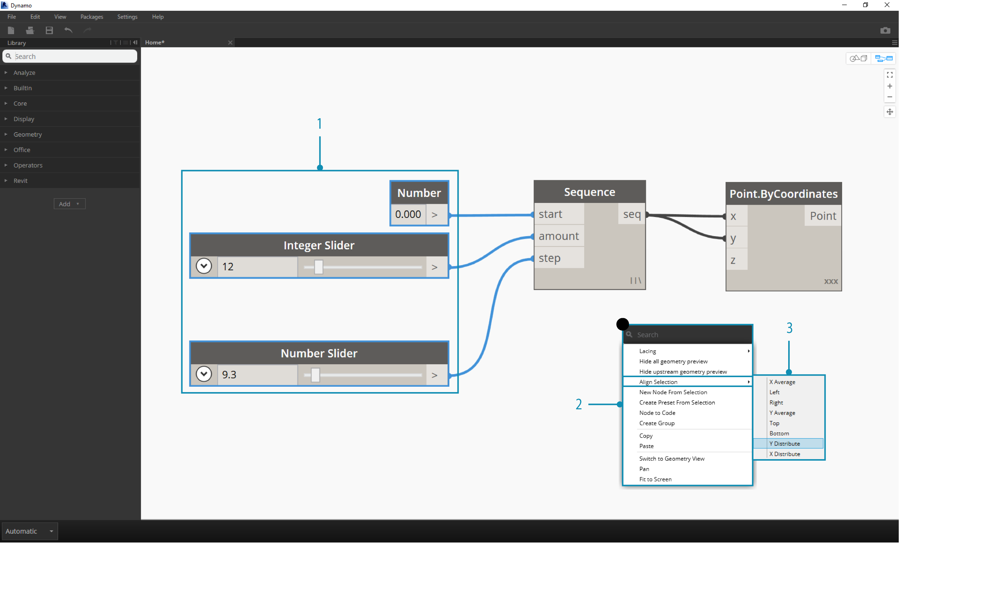
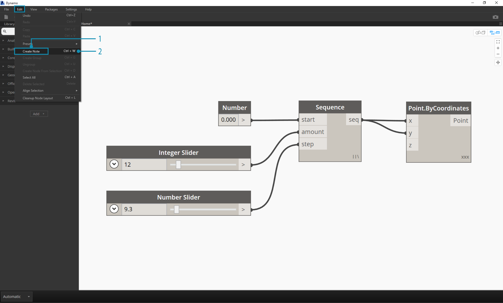
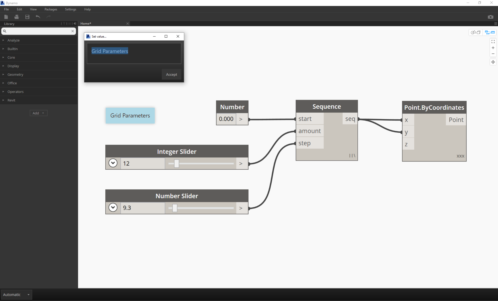
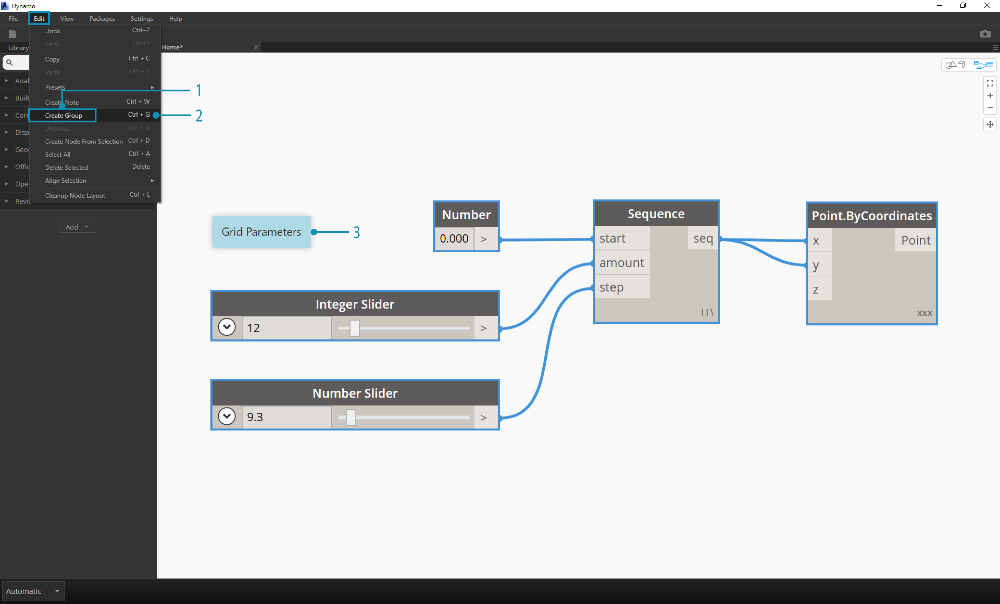
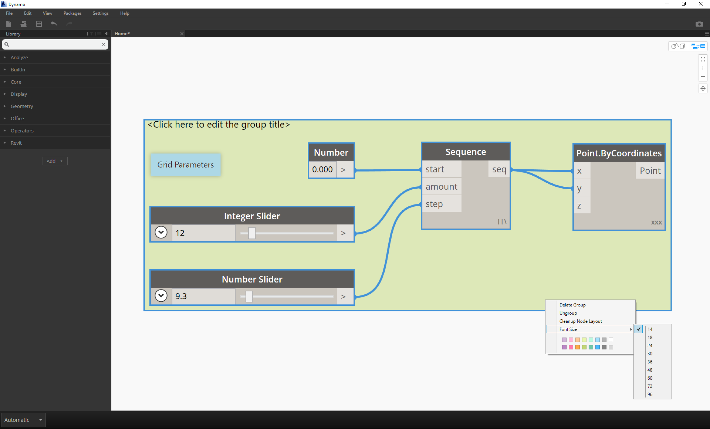
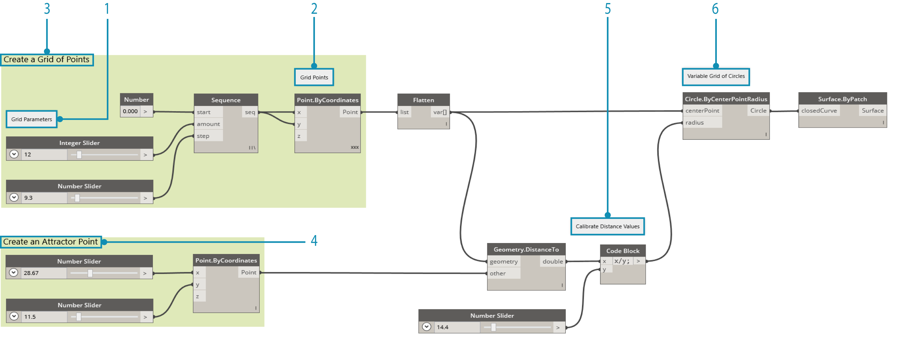

##Gestire il tuo programma

Lavorare al processo di un programma visivo può essere un'attività estremamente creativa, ma molto presto il flusso del programma e gli input chiave dell'utente potrebbero essere oscurati dalla complessità e/o dal layout dell'area di lavoro. Diamo un'occhiata alle migliori pratiche per gestire il tuo programma.

###Allineamento
Una volta che abbiamo aggiunto qualche nodo all'area di lavoro, potremmo volere riorganizzare il layout dei nodi per fare chiarezza. Selezionando più di un nodo e cliccando con il tasto destro nell'area di lavoro, la finestra a comparsa include il menù **Allinea selezione** con opzioni per la giustificazione e la distribuzione sugli assi X e Y.

> 1. Seleziona più di un nodo
2. Clicca con il tasto destro nell'area di lavoro
3. Usa le opzioni **Allinea Selezione**

###Note
Con un pò di esperienza, potremmo essere in grado di "leggere" un programma visivo solamente esaminando i nomi dei nodi e seguendo il flusso del programma. Per gli utenti di qualsiasi livello di esperienza, è una buona pratica includere delle etichette e delle descrizioni in linguaggio in chiaro. A questo scopo Dynamo mette a disposizione il nodo **Note** con un testo modificabile. Possiamo aggiungere delle note all'area di lavoro in due modi:

> 1. Dal menù File > Crea nota
2. Usando la scorciatoia da tastiera Ctrl+W

Una volta che la nota è stata aggiunta all'area di lavoro, una casella di testo comparirà consentendoci di modificare il testo nella nota. Dopo che sono state create, possiamo modificare una nota cliccandoci due volte o cliccando con il tasto destro sul nodo nota.

###Raggruppamento
Quando il nostro programma visivo diventa grande, è utile identificare le fasi principali che andranno ad essere esguite. Possiamo evidenziare grandi collezioni di nodi con un **Gruppo** per identificarle con un rettangolo colorato sullo sfondo e un titolo. Ci sono tre modi per creare un gruppo con più di un nodo selezionato:

> 1. Dal menù File > Crea gruppo
2. Usando la scorciatoia da tastiera Ctrl+G
3. Cliccando con il tasto destro nell'area di lavoro e seleziona "Crea gruppo"

Una volta che abbiamo creato un gruppo possiamo modificare le sue impostazioni, come il titolo e il colore.

> Consiglio: Usare sia le note che i gruppi è un modo efficace per commentare il tuo file e aumentarne la leggibilità.

Ecco il nostro programma dalla sezione 2.4 con aggiunti le note ed i gruppi: 

> 1. Nota: "Parametri griglia"
2. Nota: "Punti griglia"
3. Gruppo: "Crea una griglia di punti"
4. Gruppo: "Crea un punto attrattore"
5. Nota: "Calibra i valori della distanza"
6. Nota: "Gliglia variabile di cerchi"
