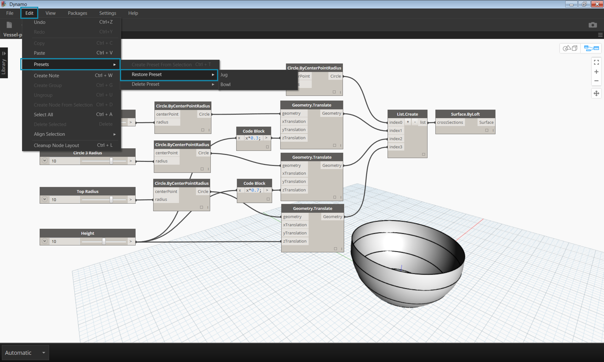

## Gestire i tuoi dati con le preimpostazioni

Nella sezione precedente abbiamo visto come gestire i programmi allineando, raggruppando, e commentando i nodi per organizzare l'area di lavoro. Queste buone pratiche aiutano a ridurre la complessità visica del tuo grafico. Ora esploreremo approfonditamente come organizzare la complessità del contenuto. Spesso, un grafico in Dynamo ha un'ampia varietà di parametri che offrono infinite iterazioni. Vogliamo organizzare questa serie di opzioni così da poter prendere delle vere decisioni in fase di progettazione - ed è qui che entrano in gioco le preimpostazioni.

Immagina di avere creato un grafico di Dynamo da condividere con un gruppo di persone così che ogni membro del gruppo possa esplorare il modello parametrico. I membri del tuo gruppo hanno ognuno un livello di esperienza diverso con la programmazione visiva, quindi vuoi offrgli delle indicazioni per esplorare diverse variabili del progetto. Il modo più semplice e facile da usare per fare ciò è utilizzando le preimpostazioni - puoi impostare un numero qualsiasi di parametri che definiscono una specifica variabile di progetto. Questo ti permette di ricaricare schemi precedenti e lavorarci parametricamente.

###Preimpostazioni

Le preimpostazioni sono un modo per prendere i valori correnti di una selezione di nodi di input e salvarli come stato preimpostato. Questi stati possono essere ripristinati dal menù Modifica>Preimpostazioni. Le preimpostazioni possono essere usate per creare e confrontare diverse variabili di progetto. Le preimpostazioni sono salvate all'interno del file, facendo di loro un utile strumento per condividere o richiedere un'opinione. Permettono anche agli altri utenti di interagire con il grafico senza dover cercare gli input rilevanti, o trovare una serie di valori che lavorano bene insieme in una prospettiva di progetto.

>1. Preimpostazione 1
>2. Preimpostazione 2

###Creare una preimpostazione

>Scarica il file di esempio che accompagna questo esercizio (tasto destro e "Salva Link come..."): [Prests.dyn](datasets/3-5/Presets.dyn). . Una lista completa dei file di esempio può essere trovata nell'Appendice.

Per creare una preimpostazione, seleziona uno o più nodi di input. Clicca con il tasto destro nell'area di lavoro e seleziona "Crea preimpostazione dalla selezione", o premi Ctrl+T.
Diamo un'occhiata ad un esempio. Qui sotto c'è un semplice grafico che crea una superficie a partire da una serie di cerchi.

>1. Gli input del grafico sono una serie di dispositivi di scorrimento che controllano altezza e raggio

>Seleziona gli input dei dispositivi di scorrimento e premi Ctrl+T

>Inserisci un nome ed una descrizione per lo stato da salvare nella finestra di dialogo. Crea diversi stati con differenti valori di input.

###Ripristinare le preimpostazioni
Per ripristinare una preimpostazione salvata, seleziona Modifica>Preimpostazioni>Ripristina preimpostazione. Così facendo in tutti i nodi verranno impostati i valori salvati. Se un nodo dello stato non è più presente nel grafico (per esempio è stato eliminato), tutti gli altri nodi nello stato verranno impostati. 

###Eliminare una preimpostazione
Per eliminare una preimpostazione, seleziona Modifica>Preimpostazioni>Elimina preimpostazione. Così facendo verrà rimosso lo stato dalla lista degli stati salvati.

