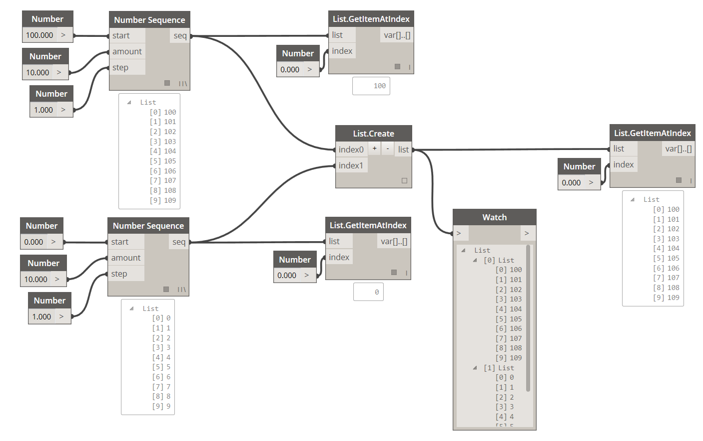
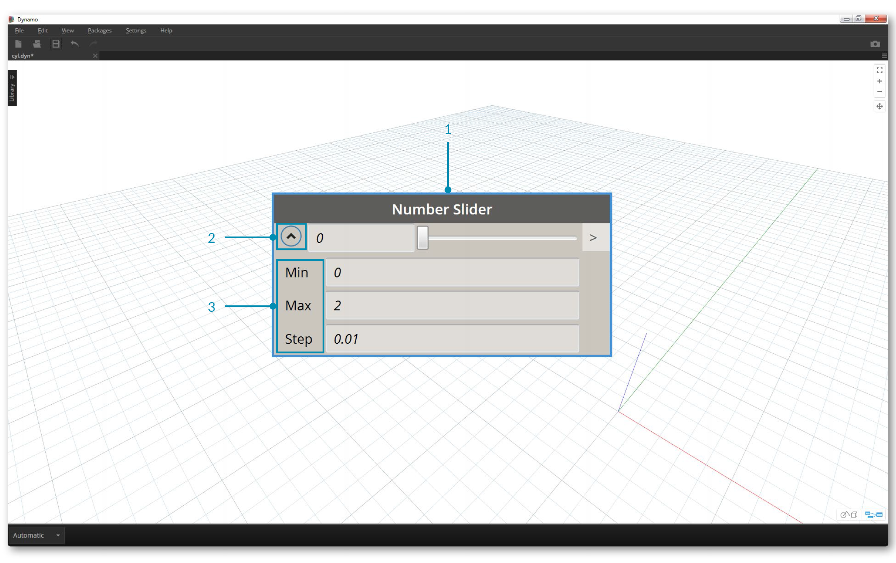

##Dati
I dati sono la "roba" dei nostri programmi. Viaggiano attraverso i wire, fornendo gli input ai nodi, dove vengono processati in una nuova forma di dati di output. Vediamo qual è la definizione di dato, come è strutturato, e come è usato in Dynamo.

###Cosa è un dato?
Un dato è una serie di valori di variabili qualitative o quantitative. La forma più semplice di dato è un numero come ```0```, ```3.14```, o ```17```. Ma un dato può anche essere un numero di tipo diverso: una variabile rappresentante numeri mutevoli (```altezza```); dei personaggi (```ilMioNome```); delle geometrie (```Cerchio```); o un elenco di oggetti di dati (```1,2,3,5,8,13,...```). Abbiamo bisogno di dati da aggiungere alle porte di input dei nodi di Dynamo - possiamo avere un dato senza un'azione ma abbiamo bisogno di un dato per eseguire l'azione che il nostro nodo rappresenta. Quando aggiungiamo un nodo all'area di lavoro, se non gli viene fornito alcun input, il risultato sarà una funzione, non il risultato della funzione stessa.


> 1. Un semplice dato
2. Dei dati ed un'azione (un nodo) eseguita con successo
3. Un'azione (un nodo) senza dati in input restituisce una funzione generica

###Conoscere i Nulls
Il tipo ```'null'``` rappresenta l'assenza di dati. Sebbene si tratti di un concetto astratto, lo incontrerai piuttosto spesso mentre lavori con la programmazione visuale. Se un'azione non genera un risultato valido, il nodo restituirà un null. Verificare i null e rimuoverli dalle strutture di dati è una parte cruciale per creare programmi robusti.

| Icona | Nome/Sintassi | Input | Output |
| -- | -- | -- | -- | -- | -- |
|  | Object.IsNull | obj | bool |

###Stutture di dati
Quando stiamo programmando vivisamente, possiamo generare velocemente moltissimi dati e aver bisogno di uno strumento per gestire la loro gerarchia. Questo è il ruolo delle strutture di dati, gli schemi organizzativi nei quali immagazziniamo i dati. Nello specifico, le strutture di dati e il modo di usarle variano a seconda del linguaggio di programmazione. In Dynamo, aggiungiamo gerarchia ai nostri dati tramite gli elenchi. Ne parleremo approfonditamente nei prossimi capitoli, ma iniziamo con qualcosa di semplice:

Un elenco rappresenta una collezione di oggetti posizionati un una struttura di dati:
* Ho cinque dita (*oggetti*) sulla mia mano (*elenco*).
* Ci sono dieci case (*oggetti*) sulla mia strada (*elenco*).



> 1. Un nodo **Number Sequence** definisce una sequenza di numeri usando gli input *start*, *amount** e *step*. Con questi nodi abbiamo creato due elenchi separati di dieci numeri, uno tra *100-109* e l'altro tra *0-9*.
2. Il nodo **List.GetItemAtIndex** seleziona un oggetto in un elenco ad un indice specifico. Quando scegliamo *0*, otteniamo il primo oggetto della lista (*100* in questo caso).
3. Applicando lo stesso processo al secondo elenco, otteniamo il valore *0*, il primooggetto dell'elenco.
4. Ora uniamo i due elenchi in uno usando il nodo **List.Create**. Nota che il nodo crea un *elenco di elenchi*. Così facendo la struttura dei dati cambia.
5. Usando ancora il nodo **List.GetItemAtIndex**, con l'indice impostato a *0*, otteniamo il primo elenco nell'elenco di elenchi. Questo è ciò che significa trattare un elenco come un oggetto, che è qualcosa di diverso da altri linguaggi di scripting. Parleremo più approfonditamente della manipolazione degli elenchi nei prossimi capitoli.

Il concetto chiave da capire sulla gerarchia in Dynamo: **con il rispetto delle strutture di dati, gli elenchi sono considerati come oggetti.** In altre parole, Dynamo funziona con un processo dall'alto in basso per capire le strutture di dati. Cosa significa? Vediamolo con un esempio. 

### Usare i dati per creare una catena di cilindri
>Scarica il file di esempio che accompagna questo esercizio (tasto destro e "Salva Link come..."): [Building Blocks of Programs - Data.dyn](datasets/4-1/Building Blocks of Programs - Data.dyn). Una lista completa dei file di esempio può essere trovata nell'Appendice.

Nel primo esempio, creeremo un cilindro cavo che si sposta tra le gerarchie delle geometrie discusse in questa sezione. 

> 1. **Point.ByCoordinates -** dopo aver aggiunto il nodo all'area di lavoro, vedremo un punto all'origine della griglia di anteprima di Dynamo. I valori di default degli input *x*, *y* e *z* sono *0.0*, facendoci ottenere un punto in questa posizione.


> 1. **Plane.ByOriginNormal -** Il prossimo passo nella gerarchia delle geometrie è un piano. Ci sono diversi modi per costruire un piano, useremo un'origine e una normale come input. L'origine è il nodo del punto creato nel passo precedente.
2. **Vector.ZAxis -** un vettore unificato (versore) nella direzione z. Nota che non ci sono input, solo un vettore di valore [0,0,1]. Lo useremo nell'input *normal* del nodo *Plane.ByOriginNormal*. Otteremo un piano rettangolare nell'anteprima di Dynamo.


> 1. **Circle.ByPlaneRadius -** Procedendo nella gerarchia, creiamo una curva dal piano nel nostro passo precedente. Dopo aver collegato il nodo, il risultato sarà un cerchio all'origine. Il raggio di default di questo nodo è *1*.


> 1. **Curve.Extrude -** Ora faremo saltar fuori il nostro oggetto dandogli della profondità e andando nella terza dimensione. Questo nodo crea una superficie da una curva, estrudendola. La distanza di default del nodo è *1*, e dovremmo vedere un cilindro nell'area di lavoro.


> 1. **Surface.Thicken -** Questo nodo ci restituisce un solido chiuso effettuando un offset della superficie per una data distanza e chiudendo la forma. Lo spessore di default è *1*, vedremo un cilindro cavo nell'area di lavoro in linea con questi valori.


> 1. **Number Slider -** Invece di usare i valori di default per tutti gli input, aggiungiamo dei controlli parametrici al modello.
2. **Modifica del dominio - **dopo aver aggiunto il number slider all'area di lavoro, clicca sul pulsante in alto a sinistra per mostrare le opzioni del dominio.
3. **Min/Max/Step -** Cambia i valori *min*, *max* e *step* a *0*,*2* e *0.01* rispettivamente. Così facendo potremo controllare la dimensione di tutta la geometria.


> 1. **Number Sliders -** In tutti gli input di default, copiamo e incolliamo questo number slider (seleziona il dispositivo di scorrimento, premi Ctrl+C, poi Ctrl+V) diverse volte, finchè tutti gli input hanno un dispositivo di scorrimento al posto del valore di default. Alcuni valori del dispositivo di scorrimento dovranno essere più grandi i zero per far funzionare la definizione (per esempio, c'è bisogno di una profondità di estrusione per dare uno spessore a una superficie).

Abbiamo così creato un cilindro cavo parametrico con questi dispositivi di scorrimento. Prova a modificare alcuni di questi parametri per vedere la geometria aggiornarsi dinamicamente nell'anteprima di Dynamo.


> 1. **Number Sliders -** Abbiamo aggiunto molti dispositivi di scorrimento all'area di lavoro, e abbiamo bisogno di riordinare l'interfaccia dello strumento che abbiamo appena creato. Clicca con il tasto destro su un dispositivo di scorrimento, seleziona "Rinomina nodo..." e cambia il nome di ogni dispositivo di scorrimento con uno appropriato al parametro che controlla. Puoi dare riferimento all'immagine sopra per i nomi.

A questo punto, abbiamo creato un fantastico "inspessore" di cilindri. Al momento abbiamo un solo oggetto, vediamo come creare una serie di cilindri che rimangano dinamicamente collegati. Per fare ciò, andremo a creare un elenco di cilindri, invece che lavorare con un singolo oggetto.


> 1. **Addizione (+) -** Il nostro obiettivo è quello di aggiungere una fila di cilindri a fianco del cilindro che abbiamo creato. Se vogliamo aggiungere un cilindro a fianco di quello corrente, dobbiamo considerare sia il raggio del cilindro che lo spessore dell'involucro. Otteniamo questo numero sommando i due valori dei dispositivi di scorrimento.


> Questo passo è più avanzato, quindi lo analizzeremo lentamente: l'obiettivo è di creare un elenco di numeri che definiscano la posizione di ogni cilindro in una riga.
1. **Moltiplicazione -** Per prima cosa, vogliamo moltiplicare il valore ottenuto precedentemente per 2. Il valore del passo precedente rappresenta il raggio, enoi vogliamo muovere il cilindro di un intero diametro. 
2. **Number Sequence -** Creeremo una sequenza di numeri con questo nodo. Il primo input è il nodo *multiplication* del passo precedente nel valore *step*. Il valore *start* può essere impostato a *0.0* usando un nodo *number*.
3.  **Integer Slider - ** Per il valore *amount*, colleghiamo un integer slider. Così facendo potremo definire quanti cilindro verranno creati.
4. **Output - ** Questo elenco ci mostra di quale distanza ogni cilindro della sequenza viene spostato, ed è parametricamente controllato dai dispositivi di scorrimento originali.


> 1. Questo passo è abbastanza semplice - inserisci la sequeza definita nel passo precedente nell'input *x* del nodo originale *Point.ByCoordinates*. Così facendo verrà rimpiazzato lo slider *pointX* che può essere cancellato. Vedremo ora una sequenza di cilindri nell'anteprima (assicurati che l'integer slider sia impostato ad un valore più grande di 0).


> La catena di cilindri è ancora collegato dinamicamente a tutti i dispositivi di scorrimento. Modifica ogni slider per vedere il risultato aggiornarsi!

