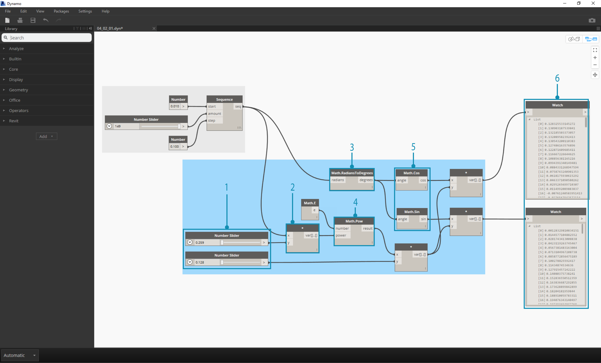

##Matematica
Se la forma di dato più semplice sono i numeri, il modo più veloce per mettere in relazione quei numeri è attraverso la matematica. Dai semplici operatori come la divisione alle funzione trigonometriche, fino alle formule più complesse, la matematica è un'ottima strada per iniziare a esplorare le relazioni numeriche e i gli schemi ricorrenti.

###Operatori aritmetici
Gli operatori sono una serie di componenti che usano funzioni algebbriche con due valori numerici in input, che restituiscono un valore di output (addizione, sottrazione, moltiplicazione, divisione, etc.). Sono disponibili in Operators>Actions.

| Icona | Nome | Sintassi| Input | Output |
| -- | -- | -- | -- | -- | -- |-- |
|  | Addizione | + | var[]...[], var[]...[] | var[]...[] |
|  | Sottrazione | - | var[]...[], var[]...[] | var[]...[] |
|  | Moltiplicazione | * | var[]...[], var[]...[] | var[]...[] |
|  | Divisione | / | var[]...[], var[]...[] | var[]...[] |

###Formule parametriche
>Scarica il file di esempio che accompagna questo esercizio (tasto destro e "Salva Link come..."): [Building Blocks of Programs - Math.dyn](datasets/4-2/Building Blocks of Programs - Math.dyn). Una lista completa dei file di esempio può essere trovata nell'Appendice.

Dagli operatori, il prossimo passo logico è combinare operatori e variabili per formare una relazione più complessa tramite le **Formule**. Realizziamo una formula che possono essere controllate da degli input parametrici, come degli slider.

>1. **Number Sequence:** definisce una sequenza di numeri basata su tre input: *start*, *amount* e *step*. Questa sequenza rappresenta la 't' nell'equazione parametrica, quindi vogliamo usare un elenco grande abbastanza da definire una spirale.

Il passo precedente ha creato un elenco di numeri per definire il dominio parametrico. La spirale aurea è definita dall'equazione: = e
=. Il gruppo di nodi sotto rappresenta questa equazione nella forma della programmazione visiva.

> Quando percorri il gruppo di nodi, prova a prestare attenzione al parallelo tra la programmazione visiva e l'equazione scritta.
1. **Number Slider:** Aggiungi due slider all'area di lavoro. Questi dispositivi di scorrimento rappresenteranno le variabili *a* e *b* dell'equazione parametrica. Queste sono costanti flessibili, o parametriche che possiamo aggiustare per ottenere il risultato desiderato.
2. ** * :** Il nodo moltiplicazione è rappresentato con un asterisco. Lo useremo ripetutamente per connettere variabili da moltiplicare.
3. **Math.RadiansToDegrees:** il valore '*t*' necessita di essere tradotto in gradi per essere valutati nelle funzioni trigonometriche. Ricorda, Dynamo richiede valori in gradi da valutare in queste funzioni.
4. **Math.Pow** come una funzione del valore '*t*' e delnumero '*e*' crea la sequenza di Fibonacci.
5. **Math.Cos e Math.Sin:** Queste due funzioni trigonometriche identificheranno rispettivamente la coordinata x e la coordinata y di ogni punto parametrico.
6.  **Watch: **Possiamo ora vedere che il nostro output sono due elenchi, che saranno le coordinate *x* e *y*dei punti usati per generare la spirale.

###Dalla formula alla geometria
Ora, la mole di nodi dei passi precedenti funzionerà bene, ma è un sacco di lavoro. Per creare un flusso di lavoro più efficiente, dai un'occhiata ai **Blocchi di codice** (sezione 3.3.2.3) per definire un'espressione di Dynamo in un nodo. Nella prossima serie di passi, vedremo come usare l'equazione parametrica per disegnare la spirale di Fibonacci.

> 1. **Point.ByCoordinates:** Collega il nodo moltiplicazionein alto nell'input '*x*' e quello in basso nell'input '*y*'. Vedremo ora una spirale parametrica di punti sullo schermo.

> 1. **Polycurve.ByPoints:** Collega il nodo Point.ByCoordinates dal passo precedente a *points*. Possiamo lasciare *connectLastToFirst* senza un input visto che non stiamo realizzando una curva chiusa. Così facendo verrà creata una spirale che passa attraverso ogni punto definito nel passo precedente.

Abbiamo così completato la spirale di Fibonacci! Da qui in poi proseguiremo lo sviluppo in due esercizi separati, che chiameremo il Nautilus e il Girasole. Si tratta di astrazioni di sistemi naturali, ma due differenti applicazioni della spirale di Fibonacci verranno rappresentate.

###Dalla spirale al Nautilus

> 1. Come punto di partenza, iniziamo con lo stesso passo dell'esercizio precedente: creare una serie di punti di una spirale con il nodo **Point.ByCoordinates**.

> 1. **Polycurve.ByPoints:** Un'altra volta, questo è lo stesso nodo dell'esercizio precedente, che useremo come riferimento.
2. **Circle.ByCenterPointRadius:** Qui useremo un nodo cerchio con gli stessi input del passo precedente. Il valore di default del raggio è *1.0*, quindi vedremo l'output immediato dei cerchi. Diventa immediatamente leggibile come i punti siallontanano man mano dall'origine.

> 1. **Circle.ByCenterPointRadius:** Per creare una serie di cerchi più dinamica, inseriamo la sequenza originale di numeri (la sequenza '*t*') nel valore del raggio.
2. **Number Sequence:** È la sequenza originale di '*t*'. Inserendola nel valore del raggio, i centri dei cerchi continuano ad allontanarsi gradualmente dall'origine, ma il raggio è in crescita, creando uno stravagante grafico di cerchi di Fibonacci. Un punto bonus se lo realizzi in 3D!

###Dal Nautilus a uno schema di fillotassi
Ora che abbiamo creato il guscio circolare di un Nautilus, passiamo alle griglie parametriche. Andremo ad applicare una rotazione base alla spirale di Fibonacci per creare una griglia di Fibonacci, la stessa determinata dalla [crescita dei fiori del girasole.](http://ms.unimelb.edu.au/~segerman/papers/sunflower_spiral_fibonacci_metric.pdf)

> 1. Ancora una volta, come punto di partenza, iniziamo con lo stesso passo dell'esercizio precedente: creare una serie di punti di una spirale con il nodo **Point.ByCoordinates**.

> 1. **Geometry.Rotate:** Ci sono diverse opzioni Geometry.Rotate; accertati di aver scelto il nodo con gli input *geometry*, *basePlane* e *degrees*. Collega **Point.ByCoordinates** all'input geometry.
2. **Plane.XY:** Collega all'input *basePlane*. Ruoteremo intorno all'origine, che è la stessa posizione della base della spirale.
3. **Number Range:** Per il nostro input in gradi, vogliamo creare rotazioni multiple. Possiamo farlo velocemente con una componente Number Range. Collegala all'input *degrees*.
4. **Number:** E per definire il campo di numeri, aggiungi tre nodi number all'area di lavoro in ordine verticale. Dall'alto in basso, assegna i valori *0.0,360.0* e *120.0* rispettivamente. Andranno a controllare la rotazione della spirale. Nota l'output che si ottiene dal nodo **Number Range** dopo aver collegato i tre nodi number al nodo. 

Il nostro output sta iniziando a somigliare ad un vortice. Aggiustiamo alcuni dei parametri di **Number Range** e vediamo come cambia il risultato:

> 1. Cambia la dimensione step del nodo **Number Range** da *120.0* a *36.0* Nota che così facendo verranno create più rotazioni e ci darà quindi una griglia più densa.

> 1. Cambia la dimensione step del nodo **Number Range** da *36.0* a *3.6*. Così facendo otteremo una griglia più densa, e la direzionalità della spirale è poco chiara. Signori e signore, abbiamo creato un girasole.

