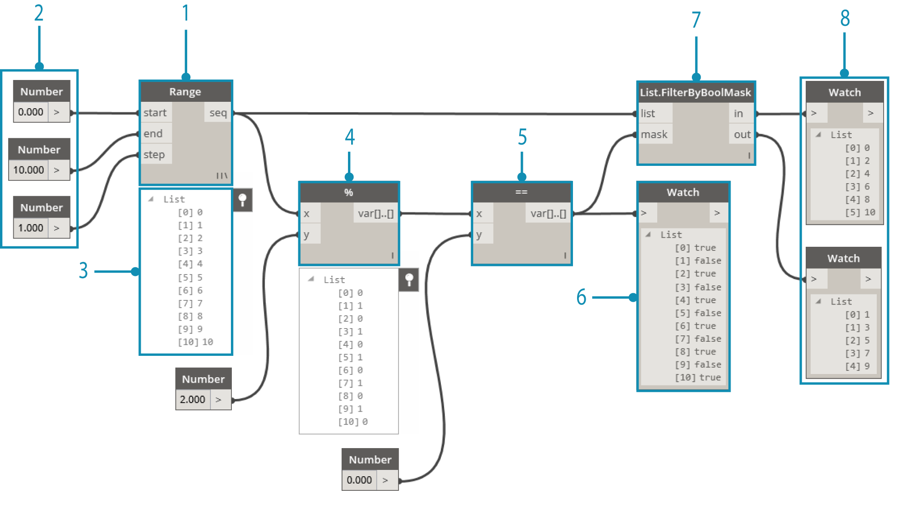
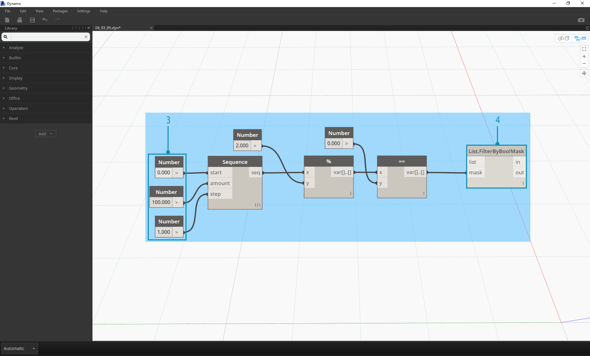
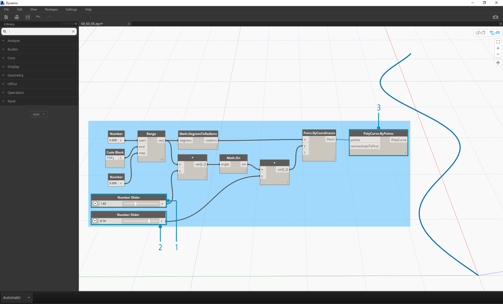
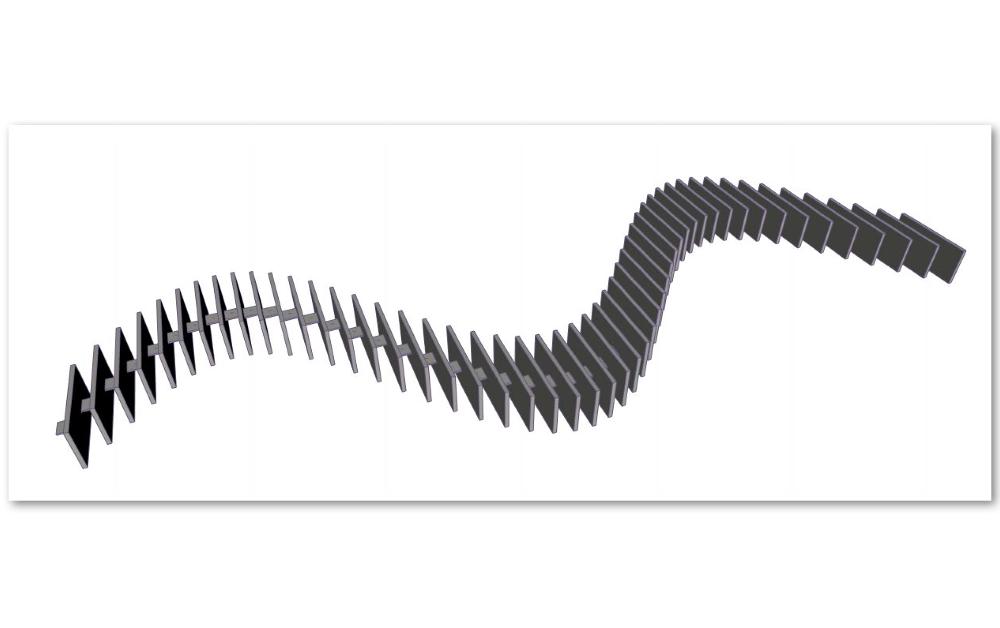
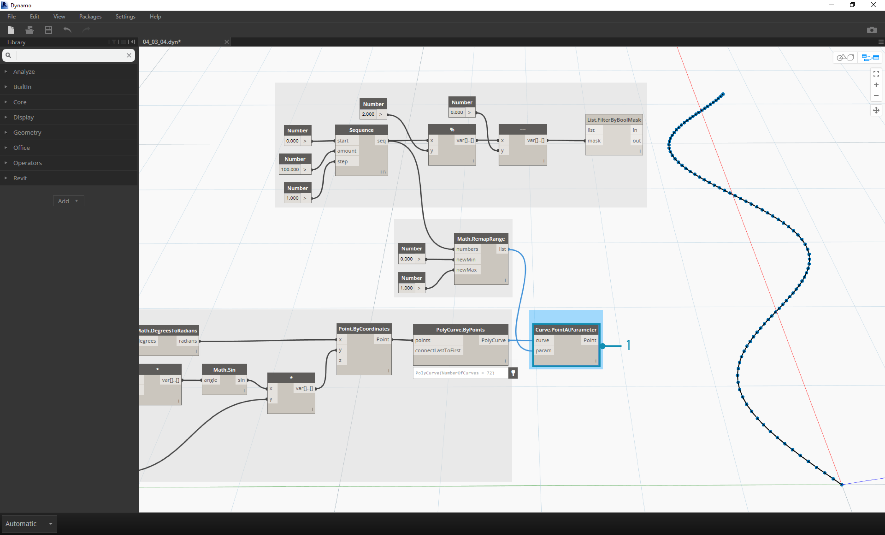
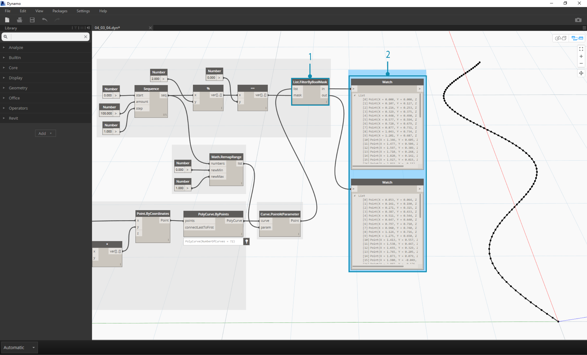
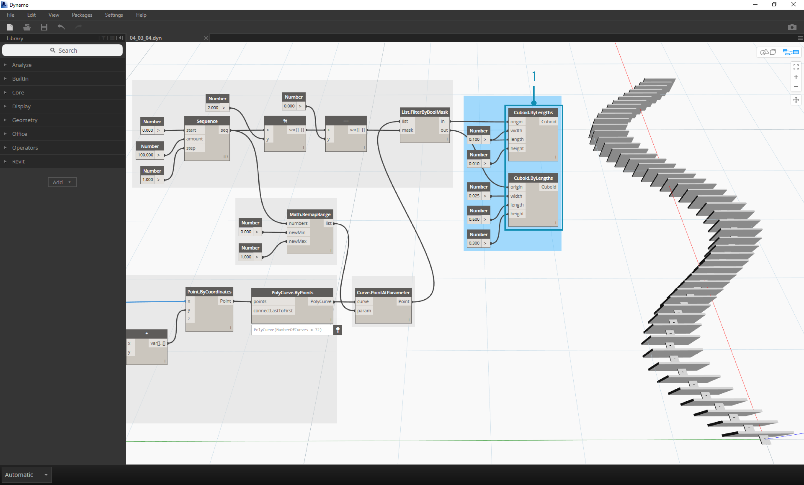

##Logica
La **Logica**, o più precisamente, un'**implicazione logica**, ci permette di specificare un'azione o una serie di azione basate su un test. Dopo aver valutato il test, avremo un valore Booleano rappresentante ```Vero``` o ```Falso``` che possiamo usare per controllare il flusso del proramma.

###Booleane
Le variabili numeriche possono memorizzare una grande varietà di numeri differenti. Le variabili booleane possono memorizzare solo due valori, a cui si fa riferimento come Vero o Falso, Si o No, 1 o 2. Le booleane vengono usate raramente per eseguire dei calcoli proprio per la loro portata limitata.

###Condizione logica
La condizione "If" è un concetto chiave nella programmazione: "Se *questo* è vero, *quello* accade, altrimento *qualcos'altro* accade. L'azione risultante della condizione è controllata da un valore booleano. Ci sono diversi modi per definire una condizione "If" in Dynamo:

| Icona | Nome | Sintassi| Input | Output |
| -- | -- | -- | -- | -- | -- |-- |
|  | If | If | test, true, false | result|
|  | Formula | IF(x,y,z) | x, y, z | result |
|  | Blocco di codice | (x?y:z)| x, y, z | result|
Vediamo un breve esempio per ciascuno di questi tre nodi in azione usando la condizione logica "If":


> In questa immagine, la *booleana* è impostata su *vero*, cioè il risultato è una stringa con scritto: *"questo è il risultato se è vero".* I tre nodi che creano la condizione *If* stanno funzionando allo stesso modo.


> Ancora una volta, i nodi stanno funzionando allo stesso modo. Se la booleano viene cambiata su *falso*, il nostro risultato è il numero *Pi*, come definito dalla condizione *If* originaria.

###Filtrare un elenco
>Scarica il file di esempio che accompagna questo esercizio (tasto destro e "Salva Link come..."): [Building Blocks of Programs - Logic.dyn](datasets/4-3/Building Blocks of Programs - Logic.dyn). Una lista completa dei file di esempio può essere trovata nell'Appendice.

Proviamo ad usare la logica per separare un elenco di numeri in un elenco di numeri pari e in un elenco di numeri dispari.


> 1. **Number Range -** aggiungi un number range all'area di lavoro.
2. **Numbers -** aggiungi tre nodi number all'area di lavoro. Il valore di ciascun nodo number dovrebbe essere: *0.0* per *start*, *10.0* per *end* e *1.0* per *step*.
3. **Output - ** il nostro output è un elenco di 11 numeri che variano da 0-10.
4. **Modulo (%)-** *Number Range* in *x* e *2.0* in *y*.  Così facendo viene calcolato il resto di ogni numero nella lista diviso per 2. L'output da questo elenco è un elenco di valori che si alternano tra 0 e 1.
5. **Test di uguaglianza (==) -** aggiungi il test di uguaglianza all'area di lavoro. Inserisci l'output *modulo* nell'input *x* e *0.0* nell'input *y*.
6. **Watch -** l'output del test di uguaglianza è un elenco di valori che si alternano tra vero e falso. Questi sono i valori usati per separare gli oggetti nell'elenco.  *0* (o *vero*) rappresenta i numeri pari e *1* (o *falso*) rappresenta i numeri dispari.
6. **List.FilterByBoolMask -** questo nodo filtrerà i valori in due elenchi diversi basati sulla booleana in input. Inserisci il *number range* originale nell'input *list* e l'output dell'*equality test* nell'input *mask*. L'output *in* rappresenta i valori veri mentre l'output *out* rappresenta i valori falsi.
7. **Watch - ** come risultato, ora abbiamo un elenco di numeri pari e un elenco di numeri dispari. Abbiamo usato gli operatori logici per separare elenchi secondo modelli logici!

###Dalla logica alla geometria
Sviluppando la logica stabilita nel primo esercizio, applichiamo questo schema in un'operazione di modellzione.


> 1. Inizieremo dall'esercizio precedente con gli stessi nodi, con alcune eccezioni:
2. Abbiamo cambiato la disposizione.
3. I valori di input sono cambiati.
4. Abbiamo disconnesso l'elenco dell'input in nel nodo *List.FilterByBoolMask*. Metteremo questi nodi da parte per adesso, ma torneranno utili più tardi nell'esercizio.


> Iniziamo collegando i nodi insieme come mostrato nell'immagine sopra. Questo gruppo di nodi rappresenta un'equazione parametrica che definisce una curva. Qualche nota:
1. Il **primo slider** dovrebbe avere un min di 1, un max di 4, e uno step di 0.01.
2. Il **secondo slider** dovrebbe avere un min di 0, un max di 1, e uno step di 0.01.
3. **PolyCurve.ByPoints -** se il diagramma di nodi qua sopra viene copiato, il risultato è una sinusoide nella vista di anteprima di Dynamo.

Il metodo usato per gli input: usa i nodi number per le proprietà più statiche e dei number slider per quelle più flessibili. Vogliamo mantenere i dominio originale che abbiamo definito all'inizio di questo passo. In ogni caso, la sinusoide che abbiamo creato dovrebbe avere della flessibilità. Possiamo muovere questi slider per vedere la curva aggiornare la sua frequenza e ampiezza.


> Stiamo per fare un piccolo salto nella spiegazione, quindi diamo un'occhiata al risultato finale così da peter avere un riferimento su ciò che stiamo cercando di ottenere. I primi due passi sono stati realizzati separatamente, ora vogliamo connetterli.Useremo la sinusoide come base per controllare la posizione dei componenti a cerniera, e useremo la logica vero/falso per alternare blocchi piccoli e blocchi grandi.


> 1. **Math.RemapRange - ** Usando la sequenza di numeri creata nel passo 01, creiamo una nuova serie di numeri rimappando il dominio. I numeri originali dal passo 01 variano tra 0-100. Questi numeri variano da 0 a 1 dagli input *newMin* e *newMax* rispettivamente.


> 1. **Curve.PointAtParameter - ** Collega *Polycurve.ByPoints* (dal passo 2) a *curve* e *Math.RemapRange* a *param*. Questo passo crea i punti sulla curva. Abbiamo rimappato i numeri da 0 a 1 proprio perchè l'input *param* richiede valori in questo intervallo. Un valore di *0* rappredenta il punto d'inizio, un valore di *1* rappresenta il punto finale. Tutti i numeri in mezzo sono contenuti nell'intervatto *[0,1]*.


> 1. **List.FilterByBoolMask - ** Collega *Curve.PointAtParameter* dal passo precedente nell'input *list*.
2. **Watch -** un nodo watch per *in* e un nodo watch per *out* mostrano che abbiamo due elenchi rappredentanti gli indici pari e gli indici dispari. Questi punti sono ordinati nello stesso nodo della curva, che dimostreremo nel prossimo passo.


> 1. **Cuboid.ByLengths -** ricrea i collegamenti visti nell'immagine sopra per avere una cerniera lungo la sinusoide. Un cuboide è semplicemente una scatola, e ne stiamo definendo le dimensioni a seconda del punto della curva al centrodel blocco. La logica della divisione pari/dispari dovrebbe ora essere chiara nel modello.


> 1. **Number Slider -** tornando all'inizio della spiegazione, possiamo modificare i number slider e vedere l'aggiornamento della cerniera. La fila di immagini in alto rappresenta diversi valori per il number slider in alto. Questa è la frequenza dell'onda.
2. **Number Slider -** la fila in basso di immagini rappresenta diversi valori per lo slider in basso. Questa è l'ampiezza dell'onda.
