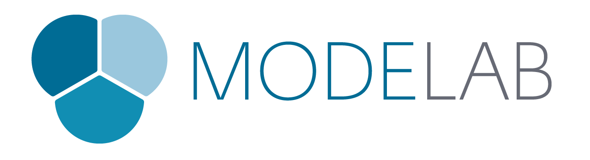

#Dynamo Primer
##Per Dynamo v1.0

> Dynamo è una piattaforma di programmazione visiva open source per progettisti.

### Benvenuto
Sei appena entrato in Dynamo Primer, un'esauriente guida alla programmazione visiva in Autodesk Dynamo Studio. Questa introduzione è un progetto in continuo sviluppo per condividere le basi della programmazione. Gli argomenti trattati includono la geometria computazionale, la realizzazione di progetti parametrici, la programmazione di applicazioni multidisciplinari, e molto altro con Dynamo.

La potenza di Dynamo può essere impegata in una grande varietà di attività relative alla progettazione. Dynamo permette di seguire diverse strade, facilmente accessibili, per iniziare ad utilizzarlo: 
* **Esplora** la programmazione visiva per la prima volta
* **Connetti** i flussi di lavoro in vari software
* **Partecipa** ad una comunità attiva di utenti, collaboratori e sviluppatori
* **Sviluppa** una piattaforma open-source in continuo miglioramento

Per orientarci in questa vivace ed eccitante opportunità di lavorare con Dynamo, abbiamo bisogno di un documento di un certo calibro, Dynamo Primer.

La Versione 1.0 di questo Primer include i primi dieci capitoli sviluppati da Mode Lab. Questi capitoli si concentrano sui fondamenti di cui avrai bisogno per essere pienamente operativo nello sviluppo dei tuoi programmi visivi con Dynamo e suggerimenti chiave per un utilizzo sempre più avanzato di Dynamo. Ecco cosa puoi aspettarti di imparare da questo primer:

* **Contesto** - Cosa è esattamente la "programmazione visiva" e quali sono i concetti che devo capire per iniziare a usare Dynamo?
* **Per cominciare** - Dove posso ottenere Dynamo e come creo il mio primo programma?
* **Cosa c'è in un programma** - Quali sono le parti che compongono Dynamo e come le utilizzo?
* **I blocchi da costruzione** - Cosa sono i "dati" e quali sono alcuni dei tipi fondamentali che posso iniziare a usare nei miei programmi?
* **Geometrie per la progettazione** - Come lavoro con gli elementi geometrici in Dynamo?
* **Liste, liste, liste** - Come gestisco e coordino le mie strutture di dati?
* **Codice nei nodi** - Come posso iniziare a estendere Dynamo con il mio codice?
* **BIM computazionale** - Come posso usare Dynamo con un modello di Revit?
* **Nodi personalizzati** - Come posso inizare a creare i miei nodi?
* **Pacchetti** - Come posso condividere i miei strumenti con la comunità?

Questo è un periodo eccitante per imparare, lavorare e sviluppare con Dynamo. Iniziamo!

---

### Open Source
Il progetto Dynamo Primer è open source! Siamo dediti a provvedere contenuti di qualità ed apprezziamo ogni opinione e suggerimento. Se volessi segnalarci un problema di qualunque genere, per favore inseriscilo sulla nostra pagina delle segnalazioni su git hub: https://github.com/DynamoDS/DynamoPrimer/issues

Se volessi contribuire ad una nuova sezione, modifica o qualunque altro contributo riguardante questo progetto, controlla la nostra pagina su github per iniziare: https://github.com/DynamoDS/DynamoPrimer.

---
### Il progretto Dynamo Primer
Dynamo Primer è un progetto open-source, iniziato da Matt Jezyk e dal Dynamo Development team di Autodesk.

**Mode Lab** è stata incaricata di scrivere la prima edizione del primer. Il team continua a lavorare con Autodesk per provvedere aggiornamenti in parallelo con lo sviluppo di Dynamo.

### Ringraziamenti

Un ringraziamento speciale a Ian Keough per avere iniziato e guidato il progetto Dynamo.

Grazie a Matt Jezyk, Ian Keough, Zach Kron e Colin McCrone per l'entusiasmante collaborazione e l'opportunità di partecipare ad una grande quantità di progetti in Dynamo.

### Software e risorse
**Dynamo** Al momento l'ultima distribuzione stabile di Dynamo è la versione 0.9.

http://dynamobim.com/download/

**DynamoBIM** La migliore fonte per informazioni aggiuntive, contenuti didattici e forum è il sito DynamoBIM.

http://dynamobim.org

**Dynamo GitHub** Dynamo è un progetto open-source sviluppato su Github. Per contribuire controlla DynamoDS.

https://github.com/DynamoDS/Dynamo

**Contattaci** Facci sapere qualunque problemi riscontri con questo documento.

Dynamo@autodesk.com

### Licenza
Copyright 2016 Autodesk

Concesso in licenza secondo i termini della Licenza Apache, versione 2.0 (la "Licenza"); è proibito usare questo file se non in conformità alla Licenza. Una copia della Licenza è disponibile all'indirizzo:

http://www.apache.org/licenses/LICENSE-2.0

Se non richiesto dalla legislazione vigente o concordato per iscritto, il software distribuito nei termini della Licenza è distribuito "COSÌ COM'È", SENZA GARANZIE O CONDIZIONI DI ALCUN TIPO, esplicite o implicite. Consultare la Licenza per il testo specifico che regola le autorizzazioni e le limitazioni previste dalla medesima.
